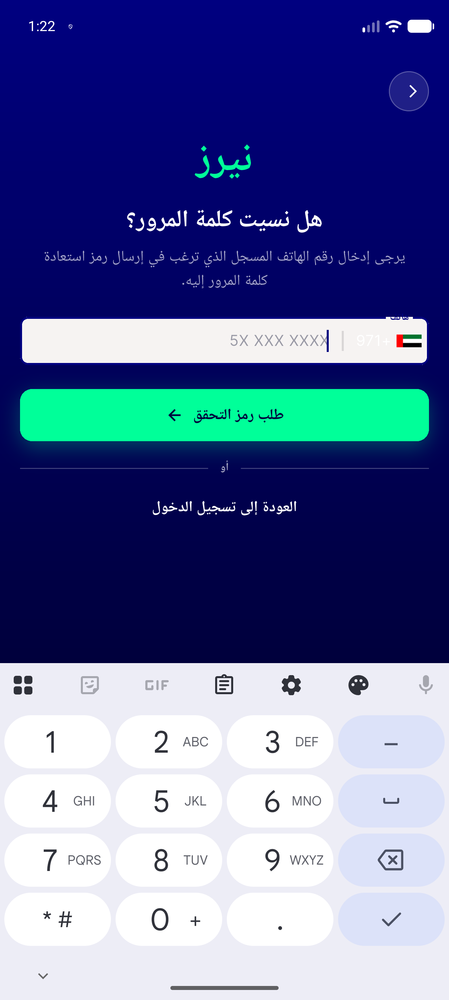
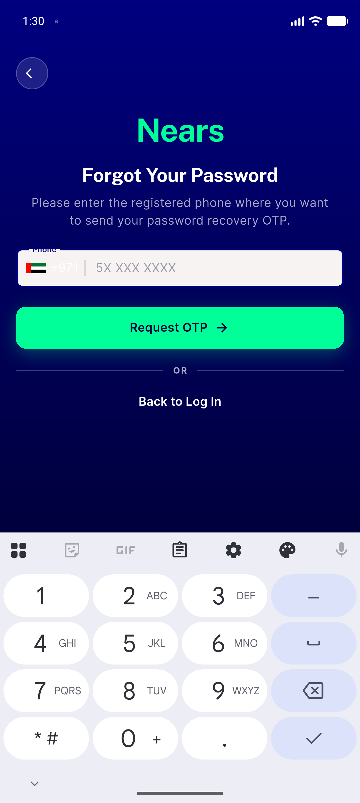
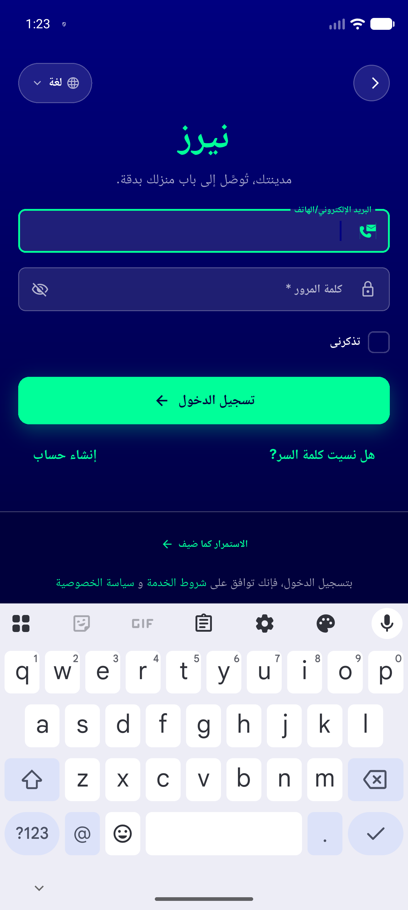
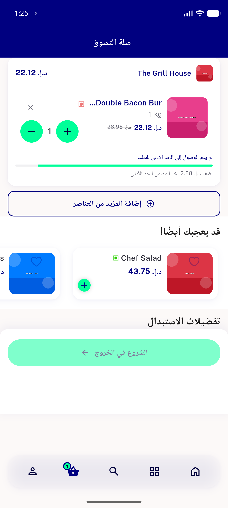
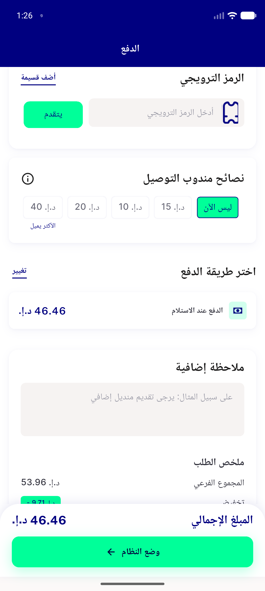
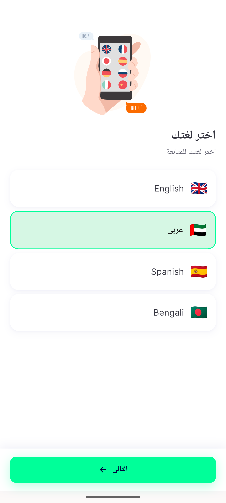
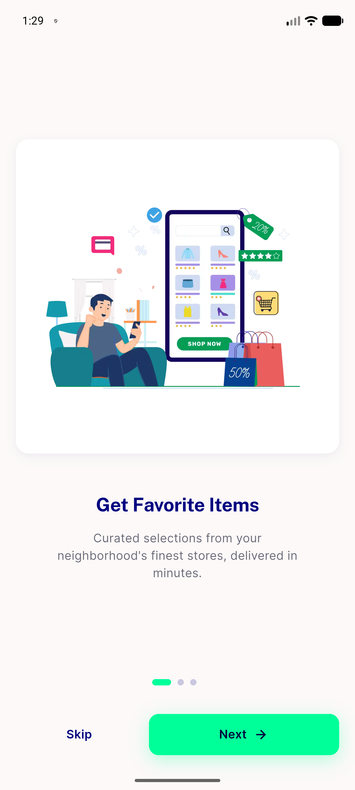

# QA Evidence — NEARS-1772

**PASS -- arrow_forward RTL mirror fix verified live on real device (emulator-5554); AC1-3 + 4 spot-check call sites all mirror correctly, 37/37 n_icon_test.dart green**

**7 screenshot(s).** Click any thumbnail for full resolution.

<table>
<tr>
<td align="center" width="33%"> ac1 forgotpass rtl arabic</td>
<td align="center" width="33%"> ac2 forgotpass ltr english</td>
<td align="center" width="33%"> ac3 nondirectional language icon rtl</td>
</tr>
<tr>
<td align="center" width="33%"> spotcheck cart checkout cta rtl</td>
<td align="center" width="33%"> spotcheck checkout proceed cta rtl</td>
<td align="center" width="33%"> spotcheck language next cta rtl</td>
</tr>
<tr>
<td align="center" width="33%"> spotcheck onboarding next cta ltr</td>
</tr>
</table>

---
*From `nears/docs/qa-evidence/NEARS-1772/` · public-repo scrub policy (no live secrets; verified clean).*
