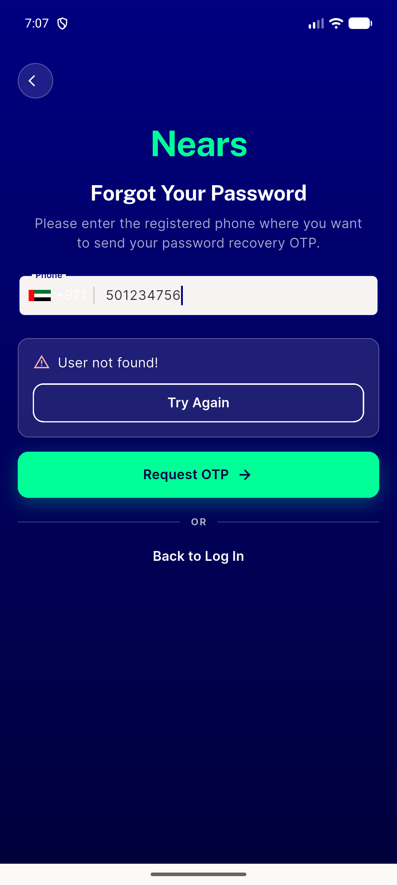

# QA Evidence — NEARS-1773

**PASS (AC1/AC3-forgot live-demonstrated; AC2/AC3-reset unverifiable — pre-existing environment blocker, see comment)**

**1 screenshot(s).** Click any thumbnail for full resolution.

<table>
<tr>
<td align="center" width="33%"> ac3 forgot pass failure</td>
</tr>
</table>

### Other artifacts
- [`ac3-correlation-join.log`](ac3-correlation-join.log)

---
*From `nears/docs/qa-evidence/NEARS-1773/` · public-repo scrub policy (no live secrets; verified clean).*
