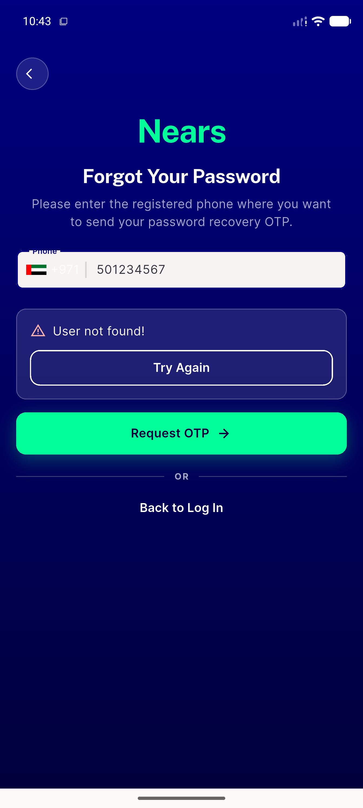
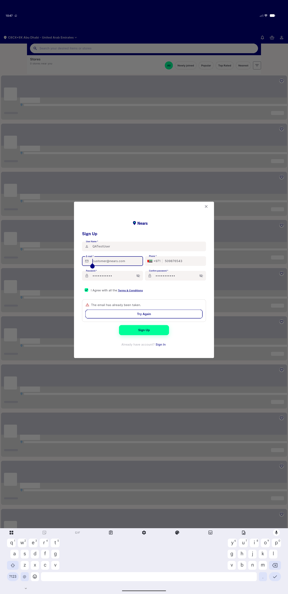
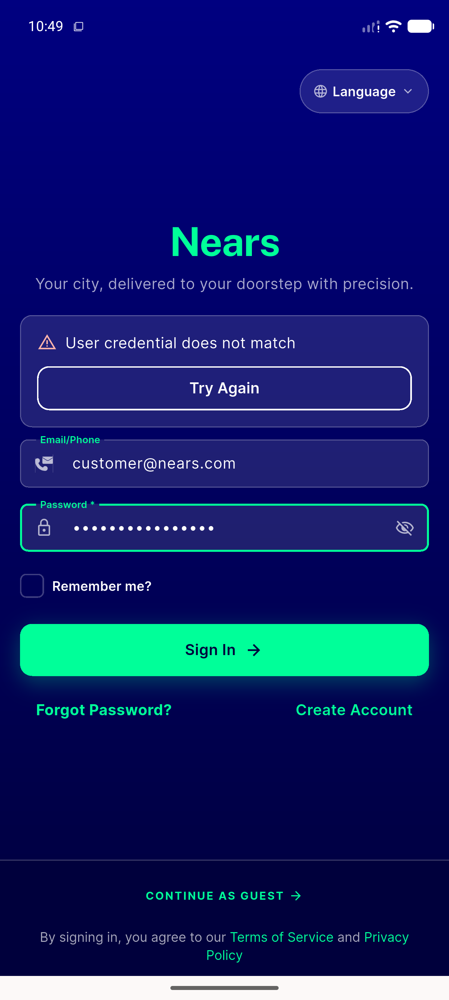
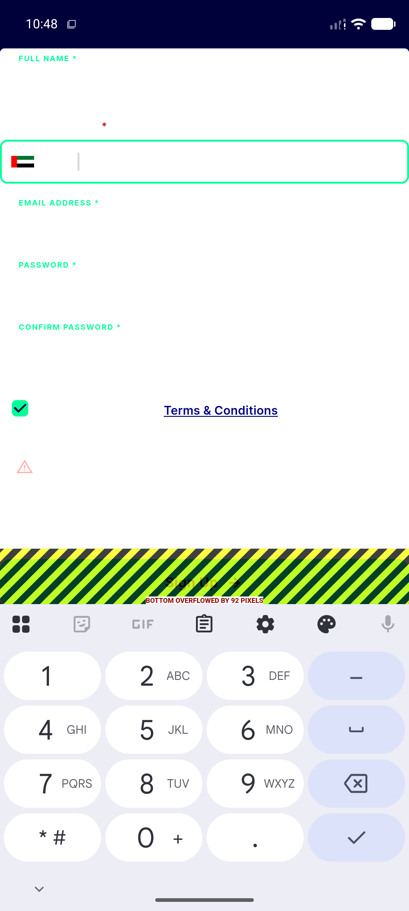

# QA Evidence — NEARS-1774

**PASS — NErrorPanel promoted to nears_dls, forget-pass + sign-up desktop verified, mobile/sign-in regression clean**

**4 screenshot(s).** Click any thumbnail for full resolution.

<table>
<tr>
<td align="center" width="33%"> ac1 forget pass error panel</td>
<td align="center" width="33%"> ac2 signup desktop error panel</td>
<td align="center" width="33%"> regression signin unchanged</td>
</tr>
<tr>
<td align="center" width="33%"> regression signup mobile unchanged</td>
</tr>
</table>

---
*From `nears/docs/qa-evidence/NEARS-1774/` · public-repo scrub policy (no live secrets; verified clean).*
