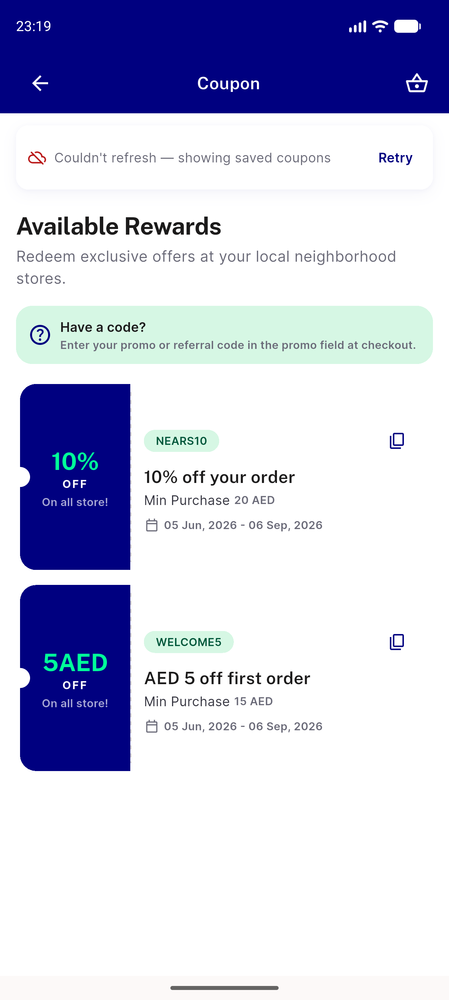
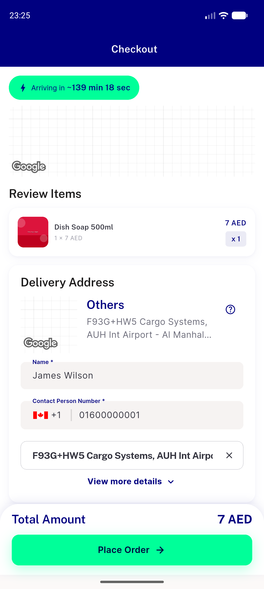
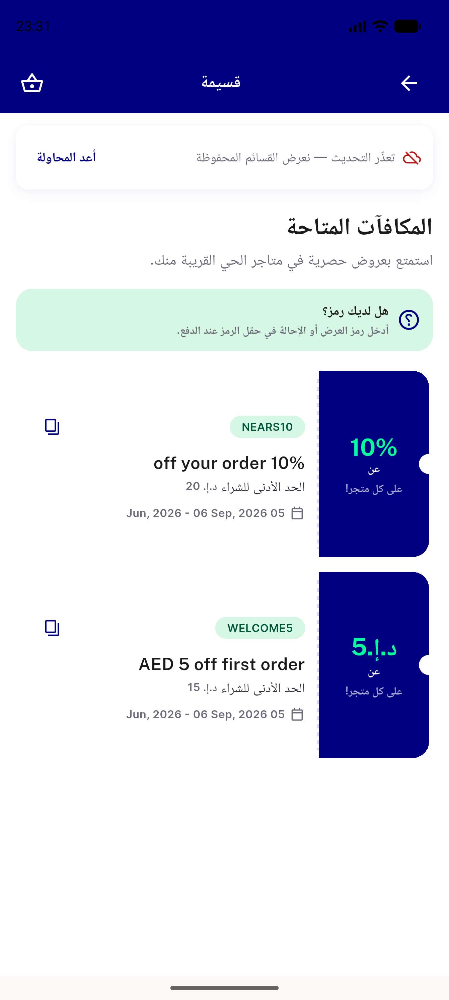
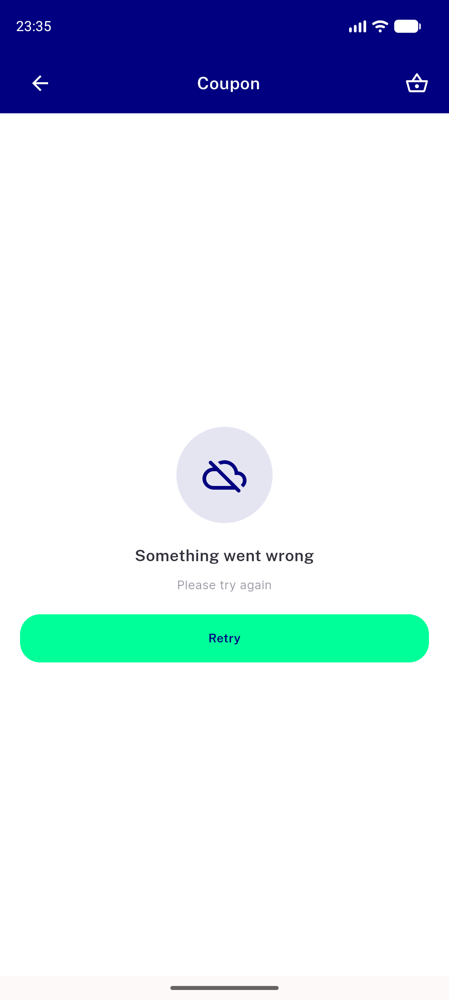
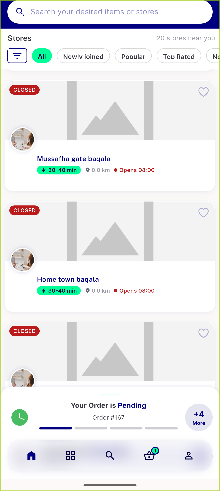

# QA Evidence — NEARS-1777

**PASS — coupon refresh-failed row proven live on injected failure; pre-fix stale-grid repro captured**

**15 screenshot(s).** Click any thumbnail for full resolution.

<table>
<tr>
<td align="center" width="33%"> fix 01 coupon online clean</td>
<td align="center" width="33%"> fix 02 AC1 row with stale grid</td>
<td align="center" width="33%"> fix 03 AC2 after retry row gone</td>
</tr>
<tr>
<td align="center" width="33%"> fix 04 AC3 pull to refresh offline</td>
<td align="center" width="33%"> fix 05 AC5 checkout chips under fault</td>
<td align="center" width="33%"> fix 05 AC5 checkout coupon chips</td>
</tr>
<tr>
<td align="center" width="33%"> fix 06 AC8 arabic rtl row</td>
<td align="center" width="33%"> fix 07 AC4 cold fullscreen error</td>
<td align="center" width="33%"> fix 08 AC1 transport class refused</td>
</tr>
<tr>
<td align="center" width="33%"> fix 08 AC1 transport class timeout row</td>
<td align="center" width="33%"> fix 09 regression category load more</td>
<td align="center" width="33%"> fix 09 regression paginated load more</td>
</tr>
<tr>
<td align="center" width="33%"> fix 10 AC1 narrow 411dp row</td>
<td align="center" width="33%"> prefix 01 coupon online baseline</td>
<td align="center" width="33%"> prefix 02 BASE stale grid no affordance</td>
</tr>
</table>

---
*From `nears/docs/qa-evidence/NEARS-1777/` · public-repo scrub policy (no live secrets; verified clean).*
