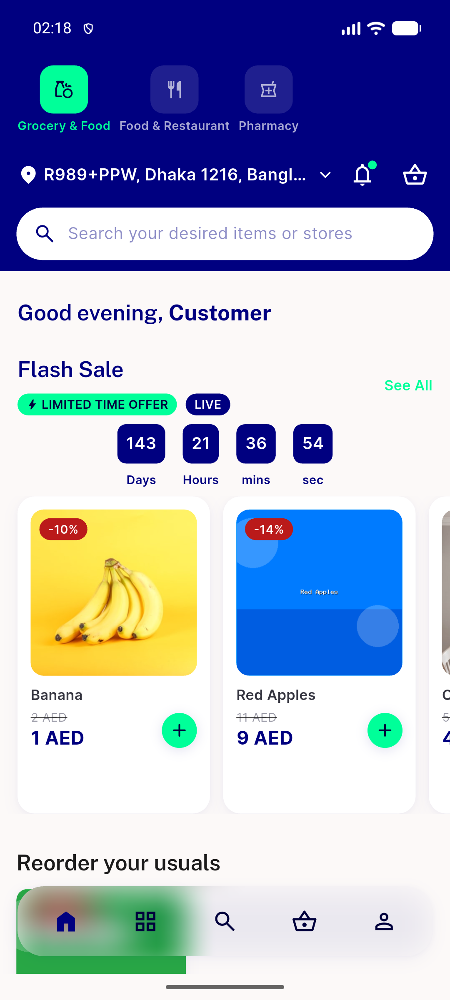

# QA Evidence — NEARS-1781

**PASS -- AC1-4 demonstrated live on emulator-5562 + Playwright fixtures; 314 assertions across 3 backstop suites green; 1 pre-existing regression noted (RenderFlex overflow, unrelated)**

**1 screenshot(s).** Click any thumbnail for full resolution.

<table>
<tr>
<td align="center" width="33%"> ac4 ui capture happy path</td>
</tr>
</table>

### Other artifacts
- [`bug-renderflex-overflow-userapp-home.log`](bug-renderflex-overflow-userapp-home.log)

---
*From `nears/docs/qa-evidence/NEARS-1781/` · public-repo scrub policy (no live secrets; verified clean).*
