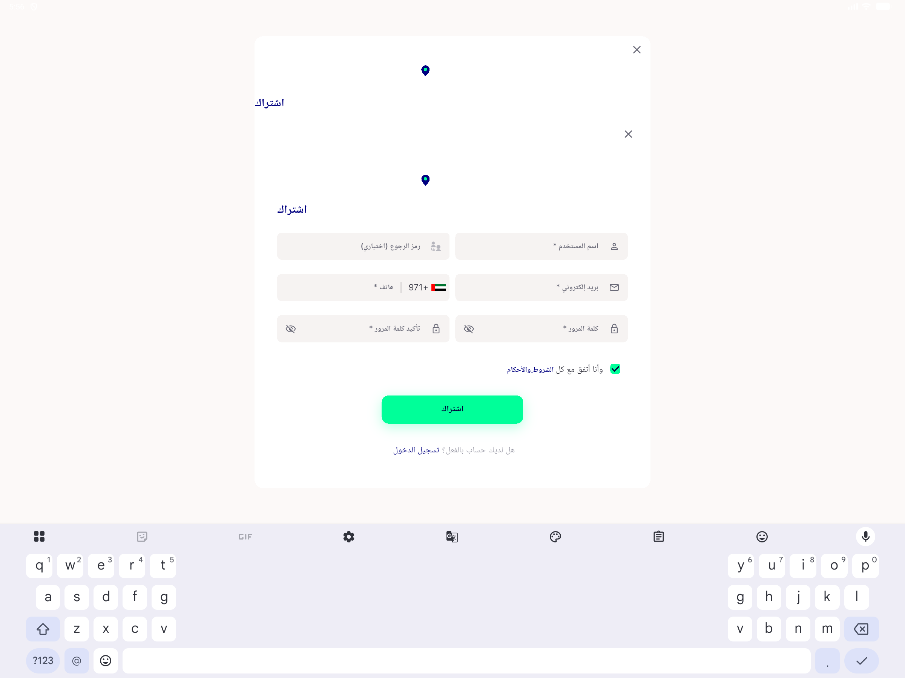
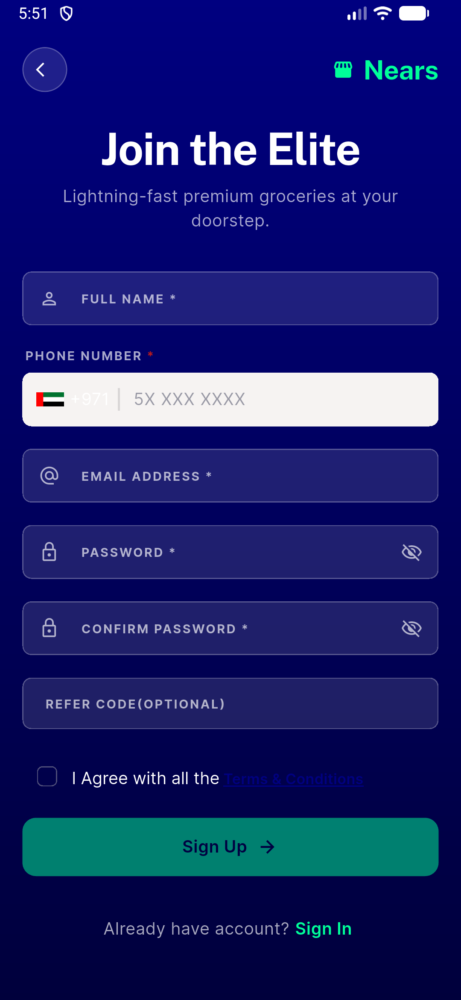
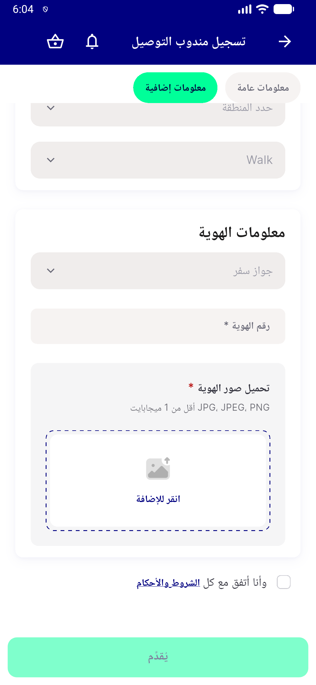

# QA Evidence — NEARS-1787

**PASS — 44dp tap target + accessible name + checked-state announce + terms gate confirmed live (LTR/RTL/desktop); regression clean on delivery-man registration**

**4 screenshot(s).** Click any thumbnail for full resolution.

<table>
<tr>
<td align="center" width="33%"> ac1 desktop signup</td>
<td align="center" width="33%"> ac1 ltr signup</td>
<td align="center" width="33%"> ac1 rtl signup</td>
</tr>
<tr>
<td align="center" width="33%"> regression dm registration checkbox</td>
</tr>
</table>

---
*From `nears/docs/qa-evidence/NEARS-1787/` · public-repo scrub policy (no live secrets; verified clean).*
