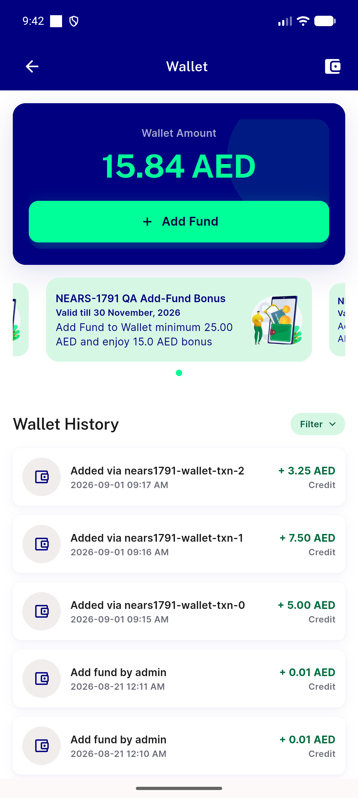

# QA Evidence — NEARS-1791

**DELTA RE-QA cycle 1: AC3a PASS - bonus banner renders after add_fund_status flip**

**1 screenshot(s).** Click any thumbnail for full resolution.

<table>
<tr>
<td align="center" width="33%"> nears1791 wallet ac3a</td>
</tr>
</table>

### Other artifacts
- [`nears1791-wallet-ac3a-dump.xml`](nears1791-wallet-ac3a-dump.xml)

---
*From `nears/docs/qa-evidence/NEARS-1791/` · public-repo scrub policy (no live secrets; verified clean).*
