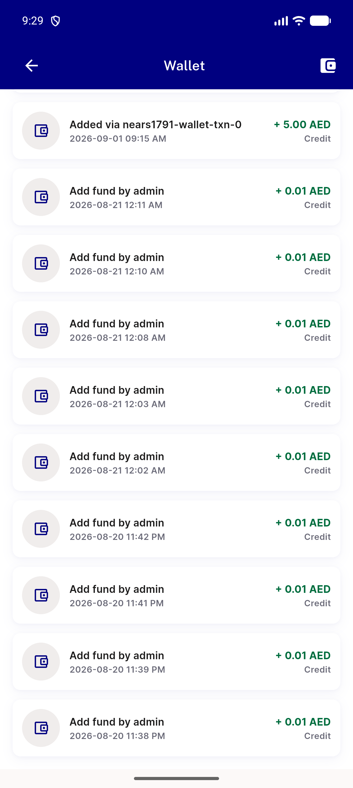
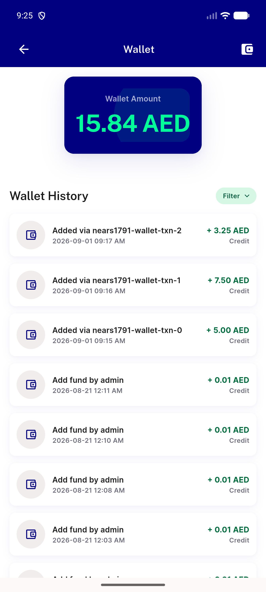

# QA Evidence — NEARS-1791

**FAIL: AC1/AC2 confirmed live; AC3a bonus banner blocked by business_settings.add_fund_status=0; AC3b load-more confirmed live**

**2 screenshot(s).** Click any thumbnail for full resolution.

<table>
<tr>
<td align="center" width="33%"> bug bonus banner gated off</td>
<td align="center" width="33%"> wallet screen top</td>
</tr>
</table>

### Other artifacts
- [`wallet-a11y-after-loadmore.xml`](wallet-a11y-after-loadmore.xml)
- [`wallet-a11y-dump.xml`](wallet-a11y-dump.xml)

---
*From `nears/docs/qa-evidence/NEARS-1791/` · public-repo scrub policy (no live secrets; verified clean).*
