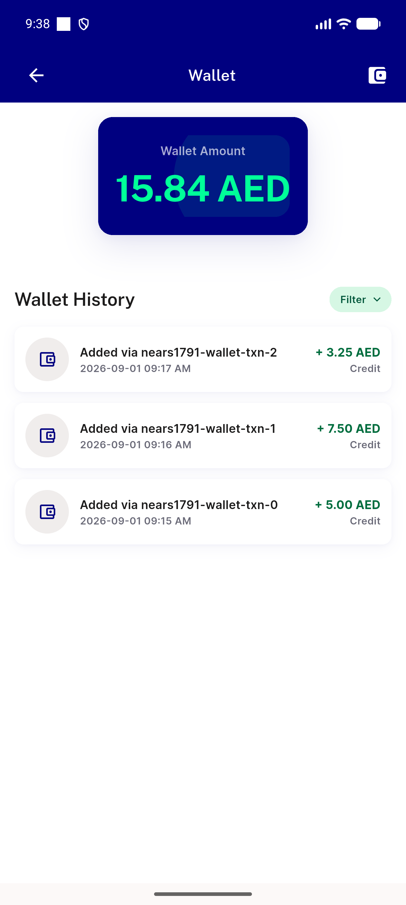
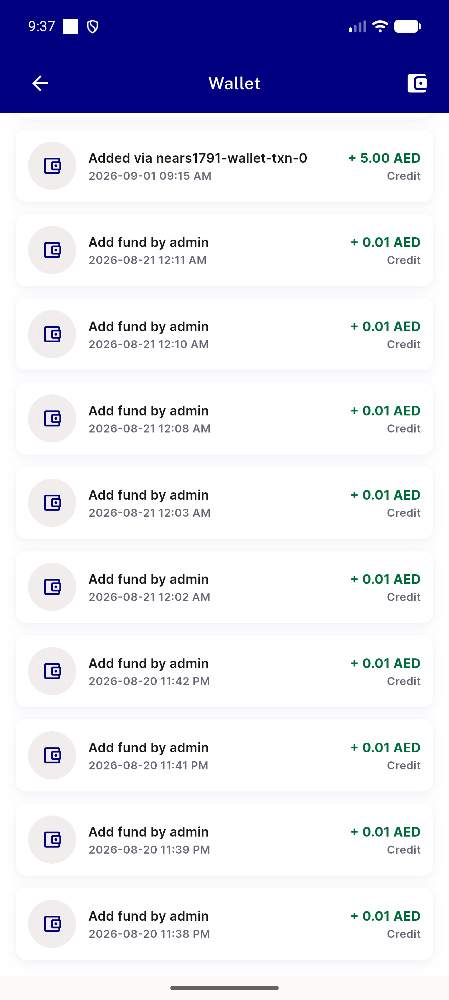

# QA Evidence — NEARS-1793

**PASS — wallet isLoading split verified live (emulator-5560); pagination guard + skeleton isolation confirmed; automated backstop 91/91**

**2 screenshot(s).** Click any thumbnail for full resolution.

<table>
<tr>
<td align="center" width="33%"> wallet filter applied</td>
<td align="center" width="33%"> wallet history loaded</td>
</tr>
</table>

---
*From `nears/docs/qa-evidence/NEARS-1793/` · public-repo scrub policy (no live secrets; verified clean).*
