# QA Evidence — NEARS-1802

**PASS — pull-to-refresh preserves the selected wallet filter (AC1 short list, AC2 overflowing viewport); 5/5 pin+control tests; suite baseline 6 unchanged**

**17 screenshot(s).** Click any thumbnail for full resolution.

<table>
<tr>
<td align="center" width="33%"><a href="00-boot.png">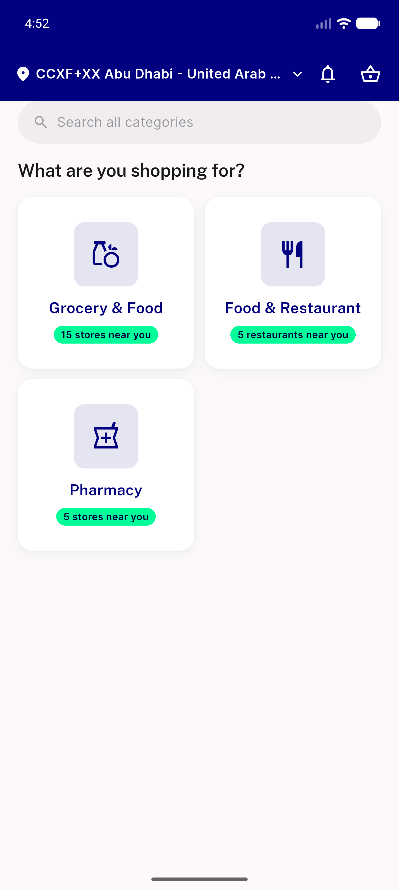</a> boot</td>
<td align="center" width="33%"><a href="ac1-01-all-4rows.png">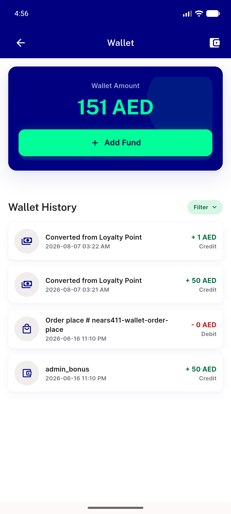</a> ac1 01 all 4rows</td>
<td align="center" width="33%"><a href="ac1-02-popup-all-selected.png">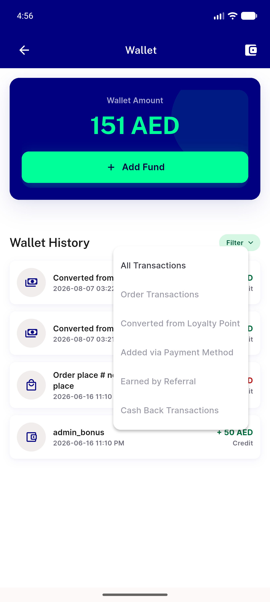</a> ac1 02 popup all selected</td>
</tr>
<tr>
<td align="center" width="33%"><a href="ac1-03-prepull-loyalty-2rows.png">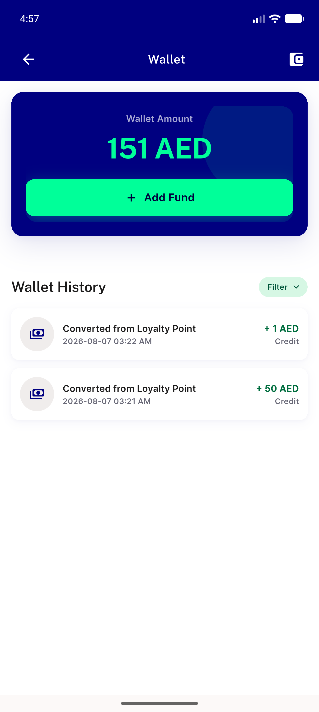</a> ac1 03 prepull loyalty 2rows</td>
<td align="center" width="33%"><a href="ac1-04-prepull-popup-loyalty-selected.png">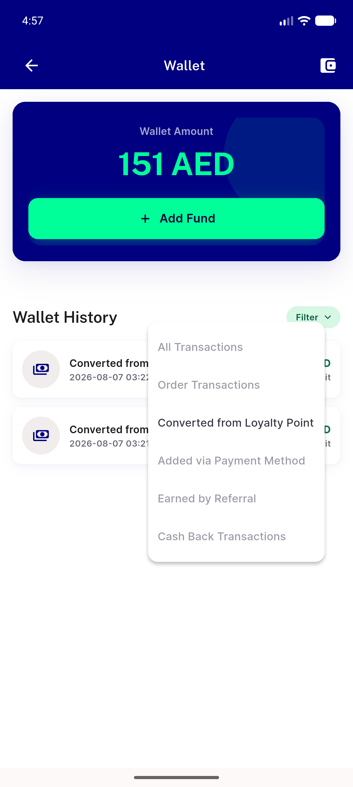</a> ac1 04 prepull popup loyalty selected</td>
<td align="center" width="33%"><a href="ac1-05-postpull-loyalty-2rows.png">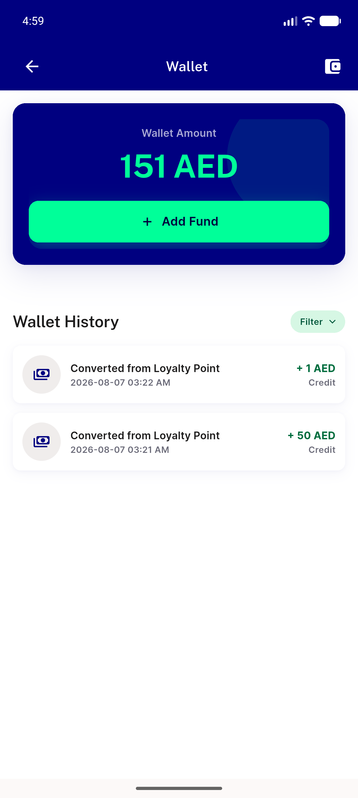</a> ac1 05 postpull loyalty 2rows</td>
</tr>
<tr>
<td align="center" width="33%"><a href="ac1-07-postpull-popup-loyalty-selected.png">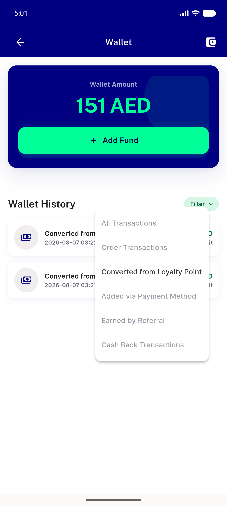</a> ac1 07 postpull popup loyalty selected</td>
<td align="center" width="33%"> ac2 01 shrunk viewport clipped</td>
<td align="center" width="33%"><a href="ac2-02-scrolled-proves-overflow.png">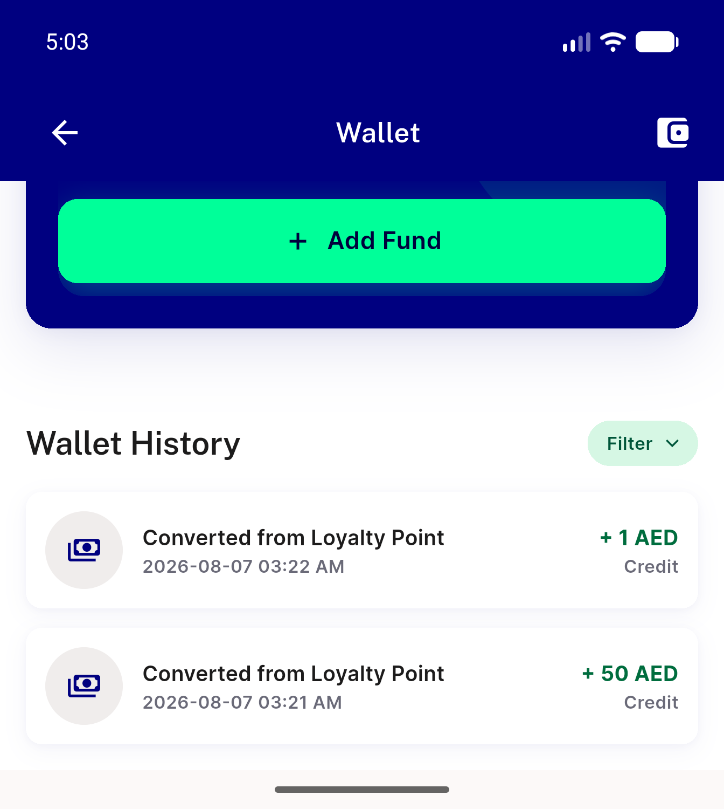</a> ac2 02 scrolled proves overflow</td>
</tr>
<tr>
<td align="center" width="33%"><a href="ac2-03-postpull-overflow.png">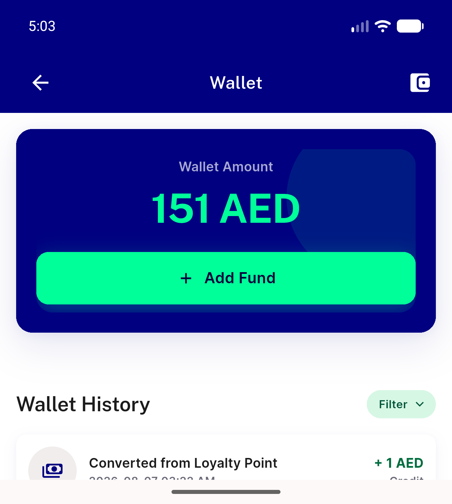</a> ac2 03 postpull overflow</td>
<td align="center" width="33%"> ac2 05 postpull scrolled loyalty only</td>
<td align="center" width="33%"><a href="ac2-06-postpull-popup-loyalty-selected.png">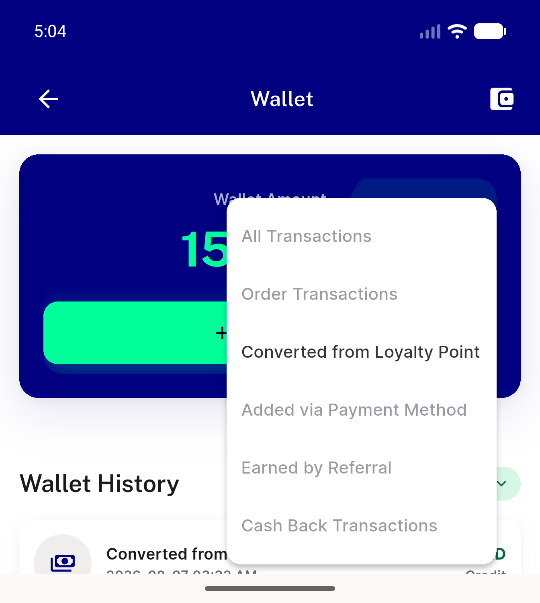</a> ac2 06 postpull popup loyalty selected</td>
</tr>
<tr>
<td align="center" width="33%"><a href="reg-01-refresh-skeleton.png">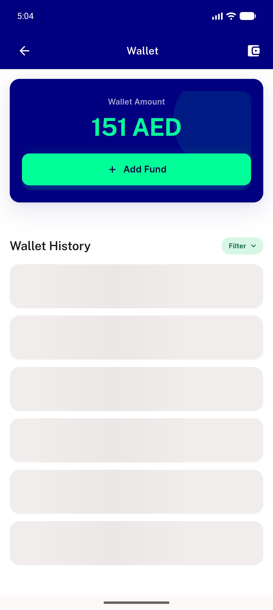</a> reg 01 refresh skeleton</td>
<td align="center" width="33%"> reg 02 reopen defaults all</td>
<td align="center" width="33%"><a href="reg-03-error-state.png">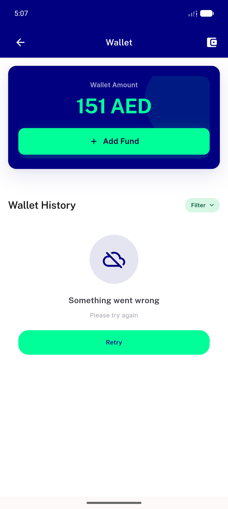</a> reg 03 error state</td>
</tr>
<tr>
<td align="center" width="33%"><a href="reg-05-empty-state-prepull.png">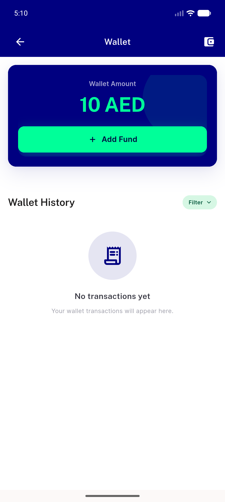</a> reg 05 empty state prepull</td>
<td align="center" width="33%"> reg 06 empty state postpull</td>
</tr>
</table>

### Other artifacts
- [`ac1-06-http-profile-loyalty.log`](ac1-06-http-profile-loyalty.log)
- [`ac2-04-http-profile-loyalty.log`](ac2-04-http-profile-loyalty.log)
- [`reg-04-retry-http-profile.log`](reg-04-retry-http-profile.log)
- [`reg-07-empty-pull-http-profile.log`](reg-07-empty-pull-http-profile.log)

---
*From `nears/docs/qa-evidence/NEARS-1802/` · public-repo scrub policy (no live secrets; verified clean).*
