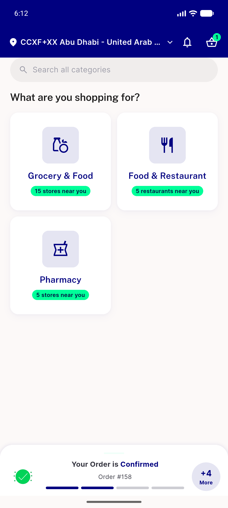
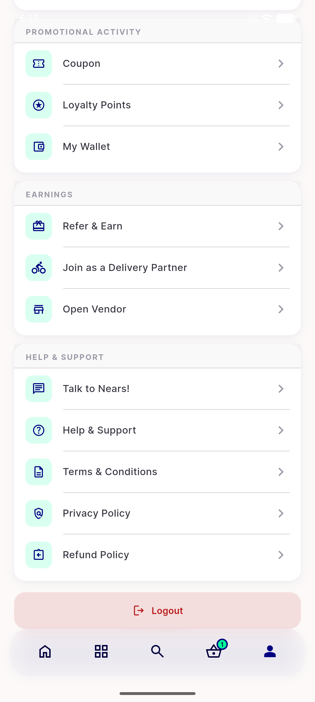
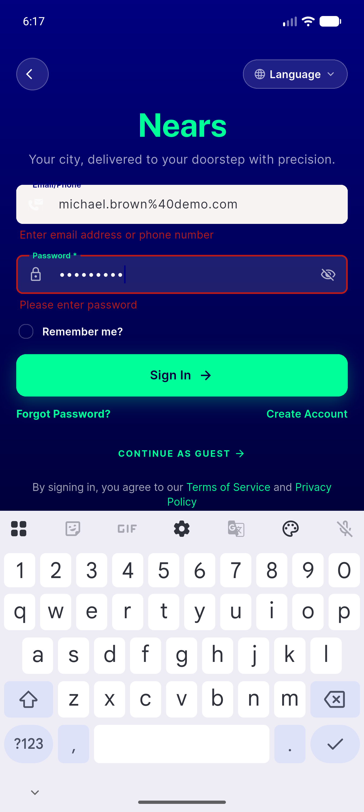
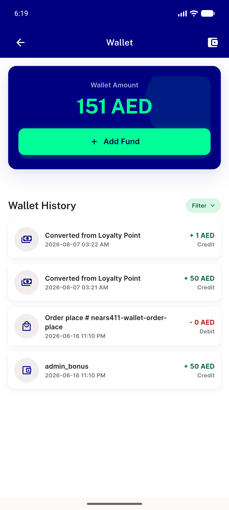
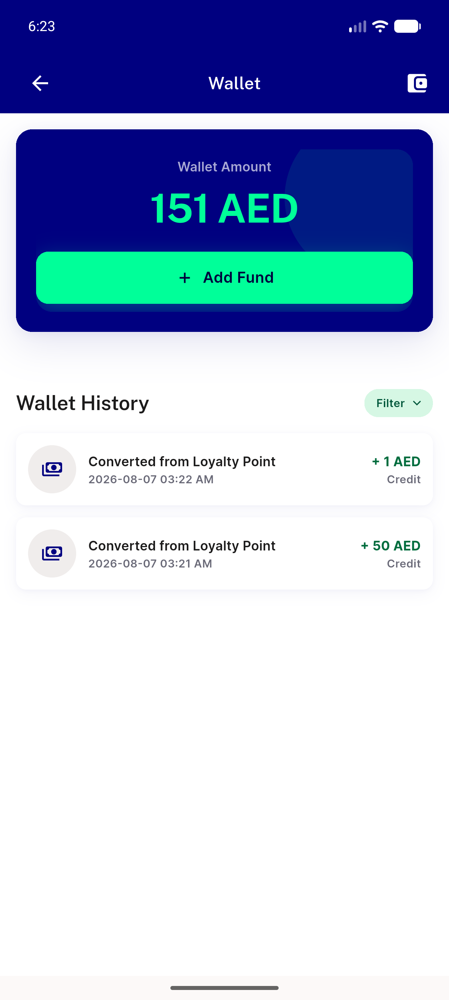
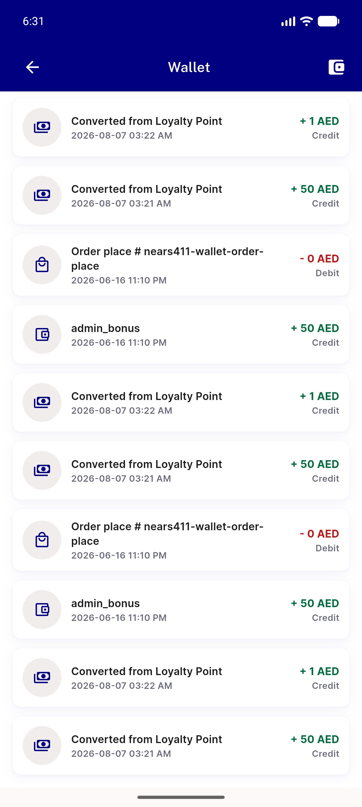

# QA Evidence — NEARS-1803

**PASS (no-regression) — wallet page-size const extraction; AC3-as-written NOT TESTED (unreachable by construction), AC3-intent OBSERVED via fault proxy**

**9 screenshot(s).** Click any thumbnail for full resolution.

<table>
<tr>
<td align="center" width="33%"> boot</td>
<td align="center" width="33%"> profile scrolled</td>
<td align="center" width="33%"> login filled</td>
</tr>
<tr>
<td align="center" width="33%"> wallet 4rows</td>
<td align="center" width="33%"> wallet scrolled bottom</td>
<td align="center" width="33%"> wallet after refresh</td>
</tr>
<tr>
<td align="center" width="33%"> wallet filter loyalty</td>
<td align="center" width="33%"> proxy loadmore bottom</td>
<td align="center" width="33%"> clean build wallet 4rows</td>
</tr>
</table>

### Other artifacts
- [`progress.md`](progress.md)

---
*From `nears/docs/qa-evidence/NEARS-1803/` · public-repo scrub policy (no live secrets; verified clean).*
