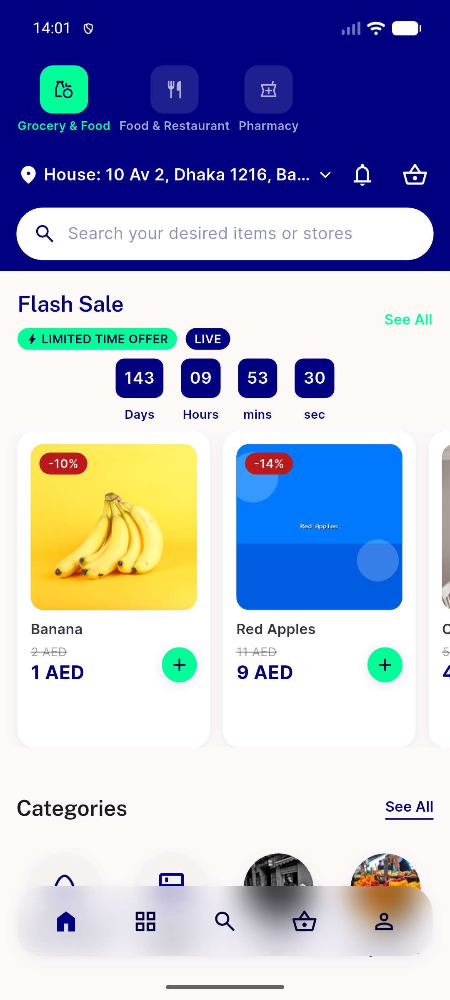

# QA Evidence — NEARS-1808

**PASS — package suffix mechanism confirmed live on emulator-5562: AC1 unset/set applicationId, AC2 dual-suffix coexistence, AC3 unsuffixed clobber contrast, AC4 static suites (41/262, 19/76 matching engineer report) + live ui_home resolution rc=0. Regression: Vendor/DeliveryApp gradle untouched.**

**1 screenshot(s).** Click any thumbnail for full resolution.

<table>
<tr>
<td align="center" width="33%"> ac4 suffixed app home tab</td>
</tr>
</table>

### Other artifacts
- [`ac1-applicationid-unset-vs-set.log`](ac1-applicationid-unset-vs-set.log)
- [`ac2-ac3-coexist-vs-clobber.log`](ac2-ac3-coexist-vs-clobber.log)
- [`ac4-static-and-live.log`](ac4-static-and-live.log)

---
*From `nears/docs/qa-evidence/NEARS-1808/` · public-repo scrub policy (no live secrets; verified clean).*
