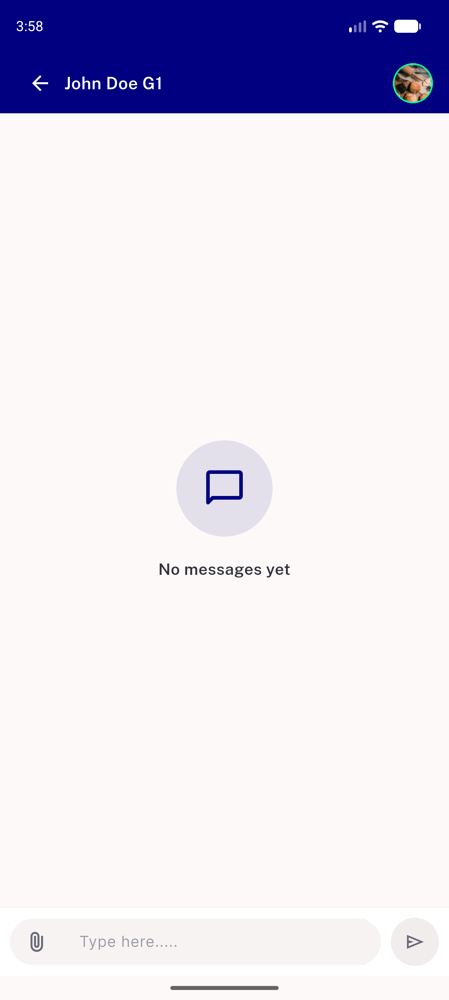
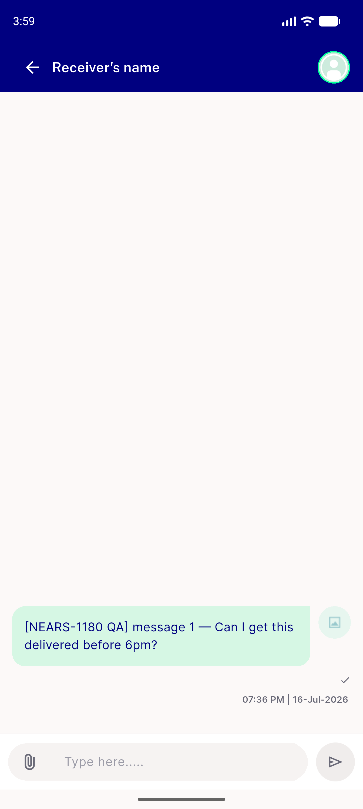
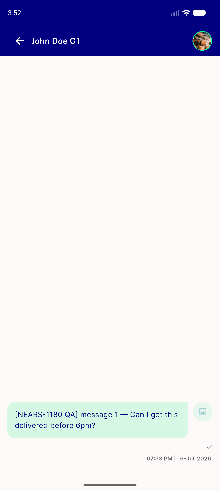

# QA Evidence — NEARS-1809

**PASS — AC1-AC4 test-verified (34/34) + live-verified on emulator-5554 (mobile arm)**

**3 screenshot(s).** Click any thumbnail for full resolution.

<table>
<tr>
<td align="center" width="33%"> ac1 live messages null empty state</td>
<td align="center" width="33%"> ac2 live receiver null placeholder</td>
<td align="center" width="33%"> ac4 live thread populated</td>
</tr>
</table>

---
*From `nears/docs/qa-evidence/NEARS-1809/` · public-repo scrub policy (no live secrets; verified clean).*
