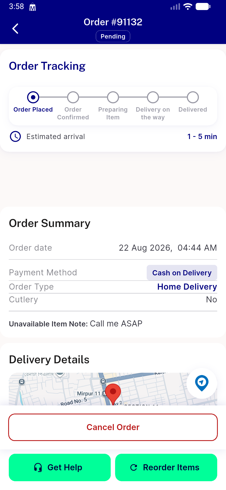
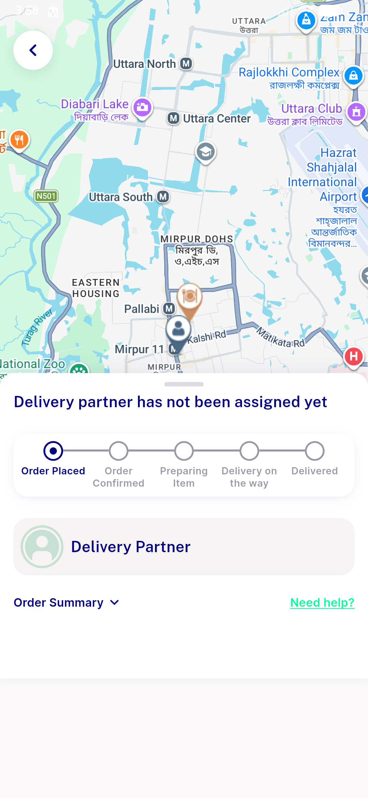
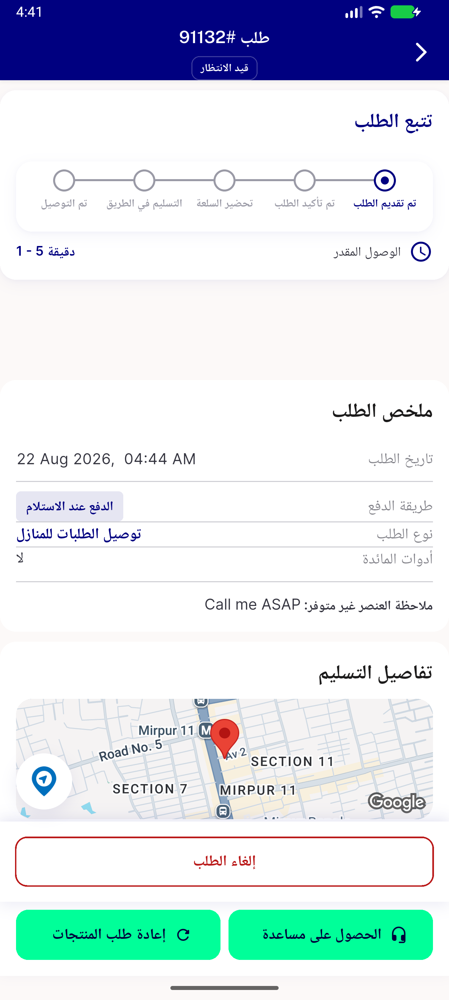
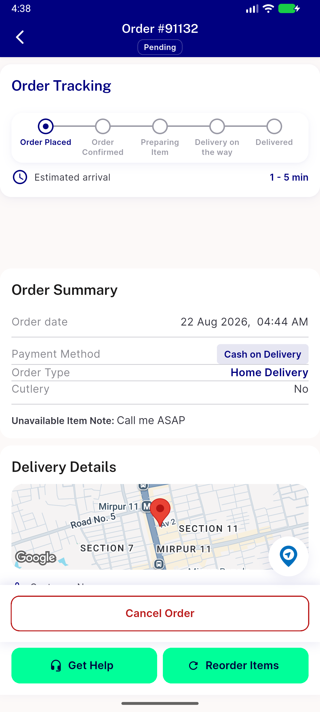
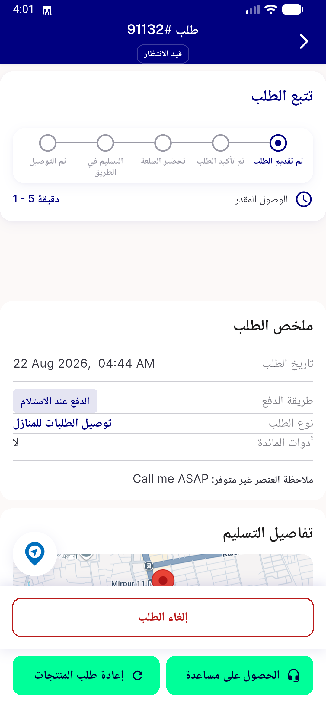

# QA Evidence — NEARS-1811

**Delta re-QA PASS (fix-cycle 1, retry) — AC1 ar FAB tooltip disambiguated (تتبع طلبك), unique + navigable; AC2 still passing; regression-clean**

**6 screenshot(s).** Click any thumbnail for full resolution.

<table>
<tr>
<td align="center" width="33%"> login flow module select</td>
<td align="center" width="33%"> AC1 AC2 en order details before</td>
<td align="center" width="33%"> AC1 AC2 en order tracking after</td>
</tr>
<tr>
<td align="center" width="33%"> ac1 ar fab unique order details</td>
<td align="center" width="33%"> ac1 en fab unique</td>
<td align="center" width="33%"> bug ar label collision</td>
</tr>
</table>

### Other artifacts
- [`ac6-fab-absent-delivered-166-dump.xml`](ac6-fab-absent-delivered-166-dump.xml)
- [`bug-ar-label-collision-dump.xml`](bug-ar-label-collision-dump.xml)
- [`bug-ar-label-collision.log`](bug-ar-label-collision.log)

---
*From `nears/docs/qa-evidence/NEARS-1811/` · public-repo scrub policy (no live secrets; verified clean).*
