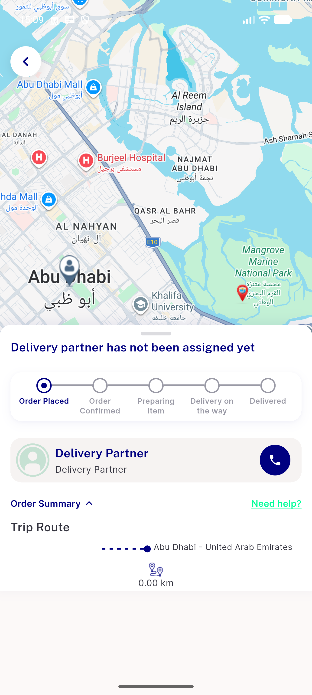
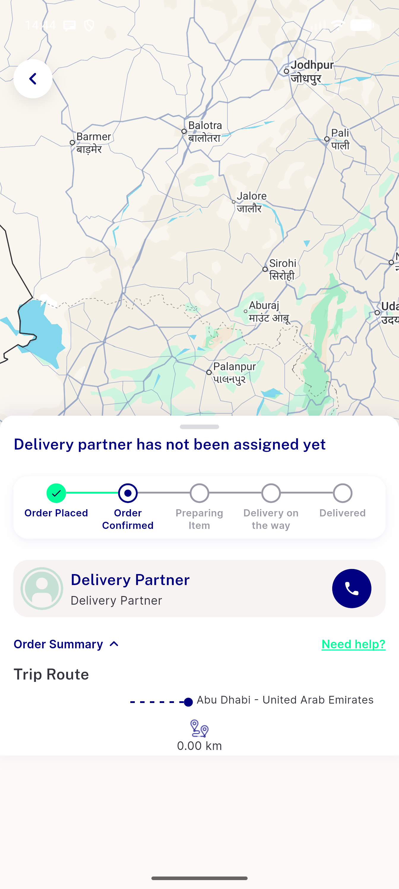
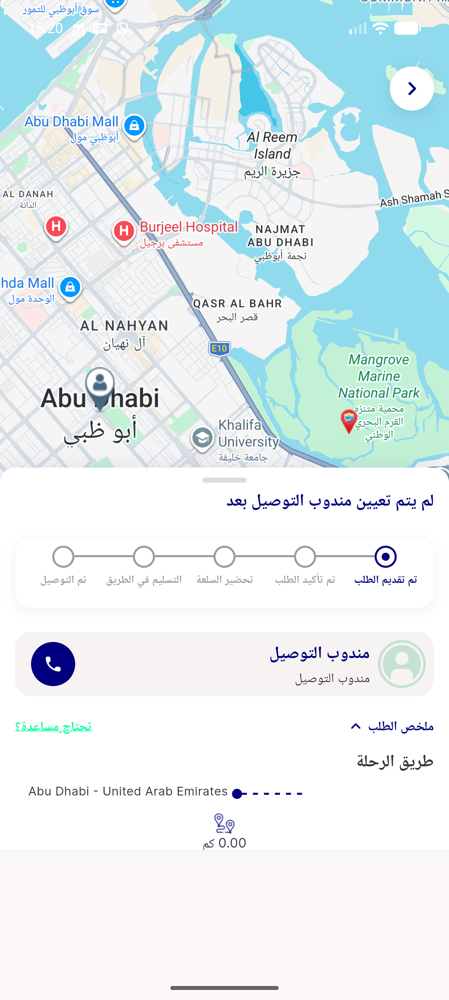

# QA Evidence — NEARS-1812

**BLOCKED — 0 defects; AC3 + AC2 take-away label are unreachable live (no take-away order can exist)**

**4 screenshot(s).** Click any thumbnail for full resolution.

<table>
<tr>
<td align="center" width="33%"> ac3 order 91119 nulladdr store trip route</td>
<td align="center" width="33%"> bug trip route empty expanded rtl</td>
<td align="center" width="33%"> reg 01 delivery order 158 expanded</td>
</tr>
<tr>
<td align="center" width="33%"> rtl arabic 91119 trip route expanded</td>
</tr>
</table>

### Other artifacts
- [`bug-track-fab-no-a11y-label.log`](bug-track-fab-no-a11y-label.log)
- [`progress.md`](progress.md)

---
*From `nears/docs/qa-evidence/NEARS-1812/` · public-repo scrub policy (no live secrets; verified clean).*
