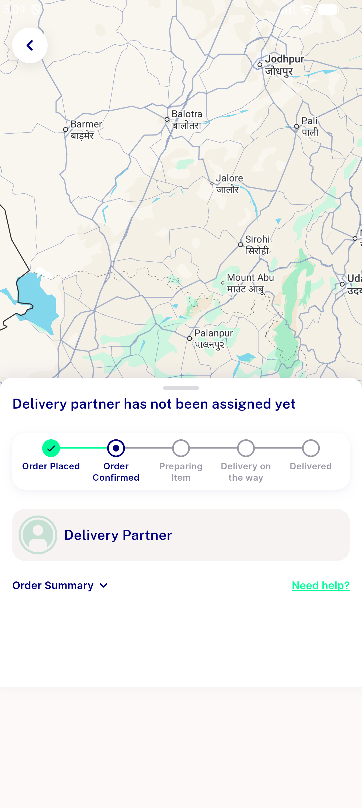
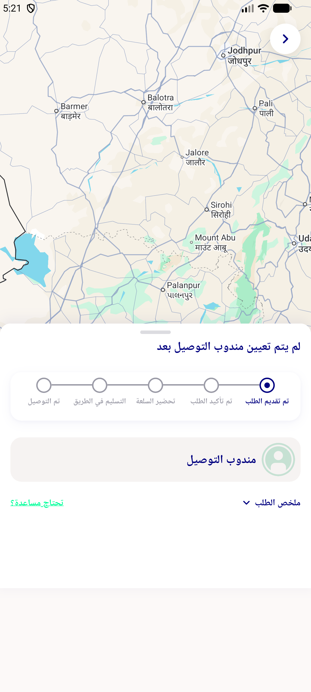

# QA Evidence — NEARS-1813

**BLOCKED — AC1/AC2/AC5 PASS live on emulator-5556; AC3 negative control has no reachable fixture (all 17 running orders in DB have delivery_man_id NULL); AC4 suite-pinned. No defect found. Suite 4/4 baseline [E], no regression.**

**2 screenshot(s).** Click any thumbnail for full resolution.

<table>
<tr>
<td align="center" width="33%"> ac1 ac2 no partner call absent</td>
<td align="center" width="33%"> rtl arabic no partner</td>
</tr>
</table>

---
*From `nears/docs/qa-evidence/NEARS-1813/` · public-repo scrub policy (no live secrets; verified clean).*
