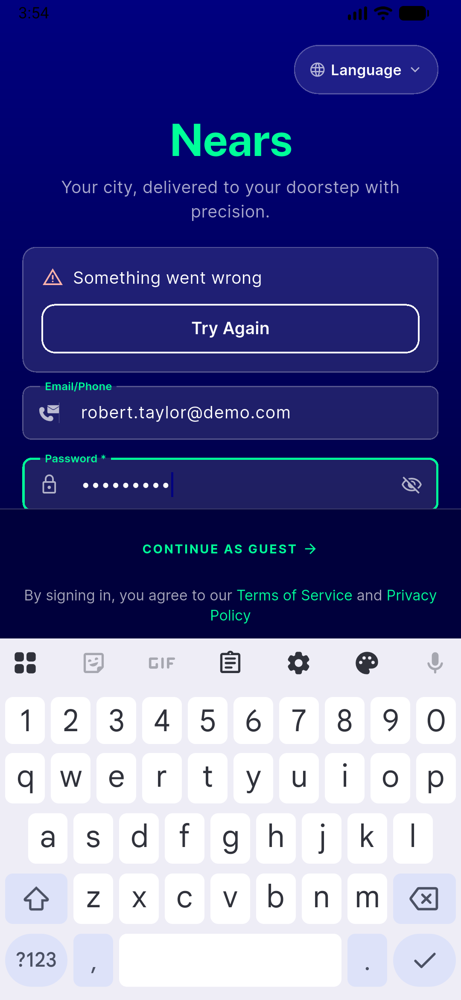

# QA Evidence — NEARS-1816

**BLOCKED — primary backend Passport oauth keys missing, auth broken for all users; unrelated to this ticket's seeder-only change**

**1 screenshot(s).** Click any thumbnail for full resolution.

<table>
<tr>
<td align="center" width="33%"> bug backend passport keys missing login fail</td>
</tr>
</table>

### Other artifacts
- [`bug-backend-passport-keys-missing.log`](bug-backend-passport-keys-missing.log)

---
*From `nears/docs/qa-evidence/NEARS-1816/` · public-repo scrub policy (no live secrets; verified clean).*
