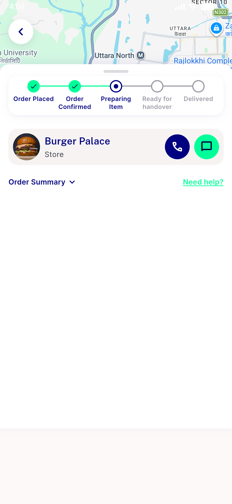

# QA Evidence — NEARS-1816

**PASS (cycle 1) — AC1/AC2 demonstrated live after backend Passport-key restoration; regression sweep clean**

**3 screenshot(s).** Click any thumbnail for full resolution.

<table>
<tr>
<td align="center" width="33%"> ac2 order91133 chat restaurant branch</td>
<td align="center" width="33%"> ac2 order91133 details no delivery partner</td>
<td align="center" width="33%"> bug backend passport keys missing login fail</td>
</tr>
</table>

### Other artifacts
- [`bug-backend-passport-keys-missing.log`](bug-backend-passport-keys-missing.log)

---
*From `nears/docs/qa-evidence/NEARS-1816/` · public-repo scrub policy (no live secrets; verified clean).*
