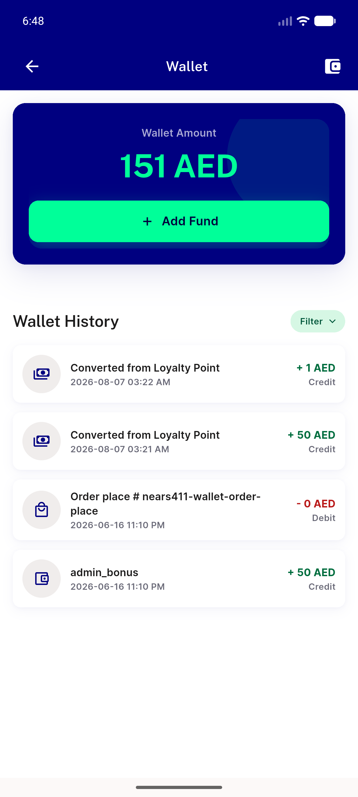
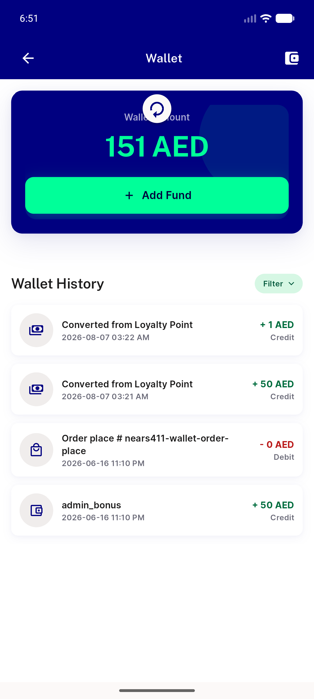
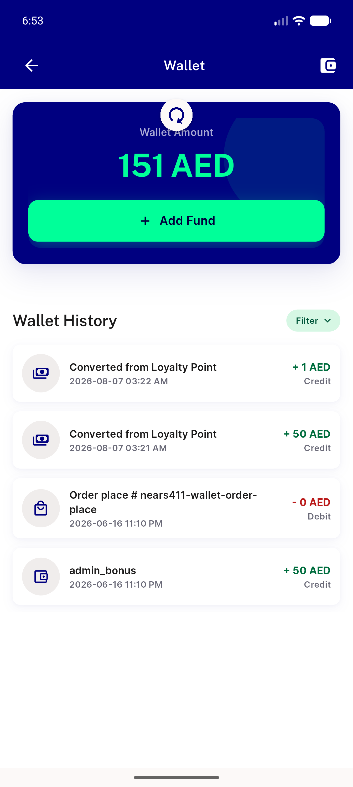
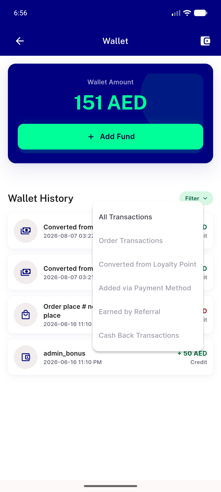
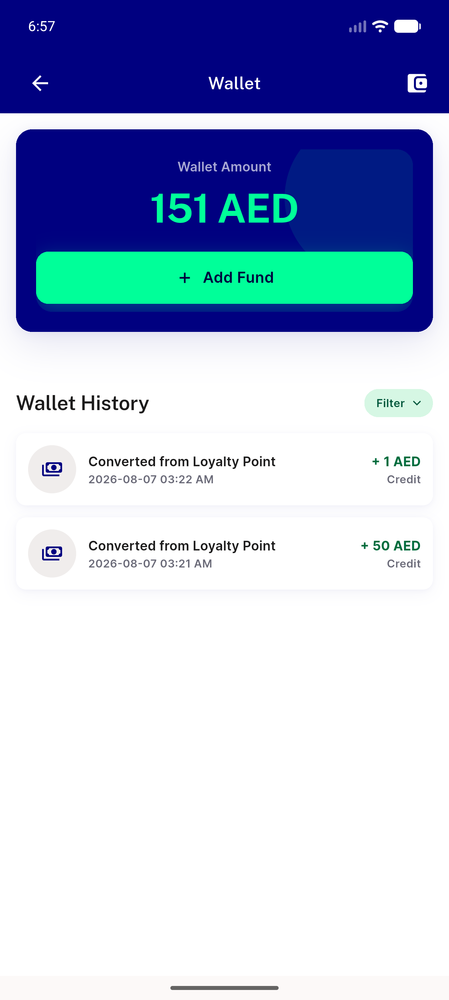
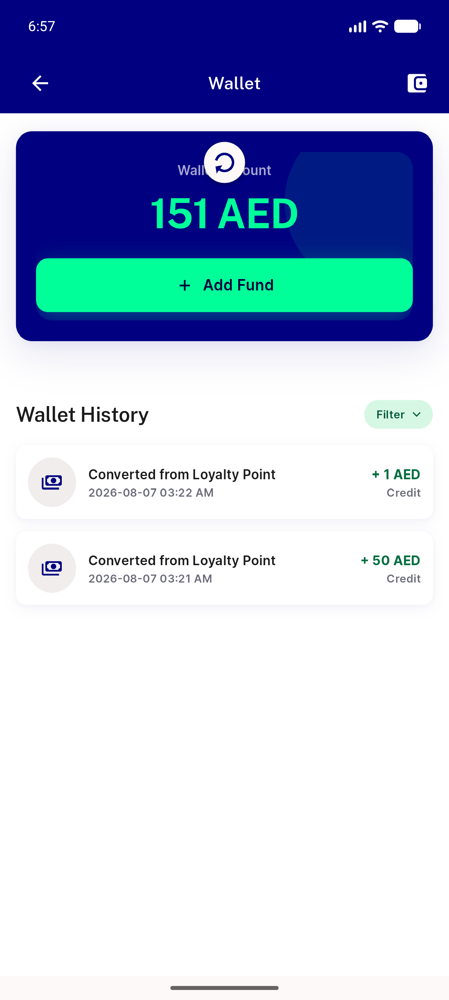
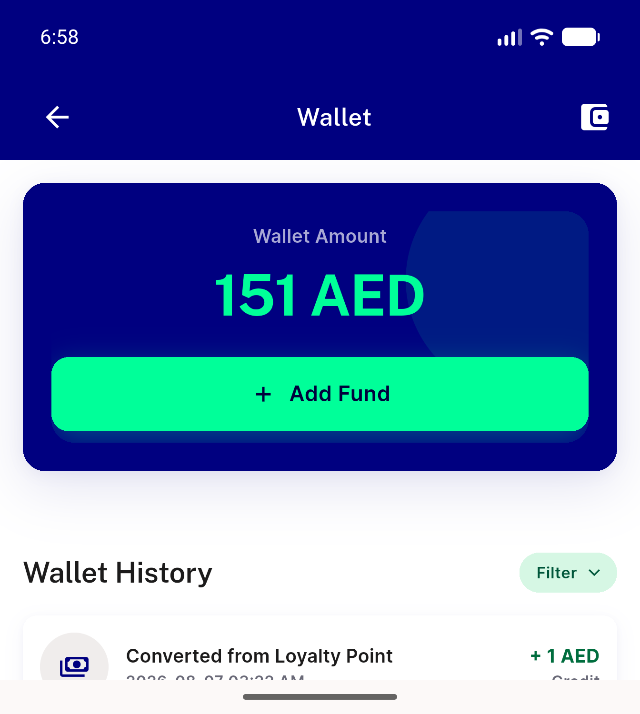
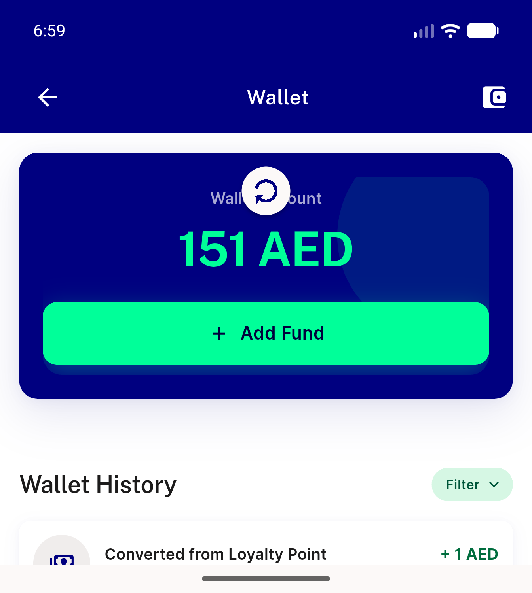
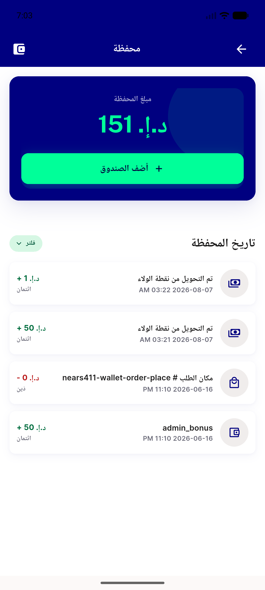
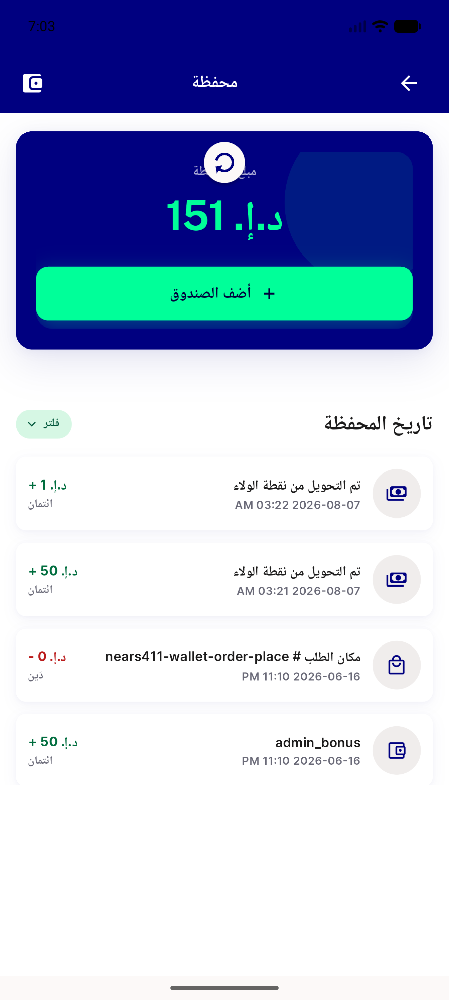

# QA Evidence — NEARS-1818

**PASS — NEARS-1818 wallet refresh puck: AC1/AC2/AC3 all met live on emulator-5558 (448x997dp); worst puck-vs-balance clearance +12.3 dp, settle bit-identical, refresh fires 2 reqs / 4 [NET] 200s**

**14 screenshot(s).** Click any thumbnail for full resolution.

<table>
<tr>
<td align="center" width="33%"> wallet settled</td>
<td align="center" width="33%"> drag early</td>
<td align="center" width="33%"> drag mid</td>
</tr>
<tr>
<td align="center" width="33%"> drag max</td>
<td align="center" width="33%"> refreshing retraction</td>
<td align="center" width="33%"> settle before</td>
</tr>
<tr>
<td align="center" width="33%"> settle after</td>
<td align="center" width="33%"> filter popup open</td>
<td align="center" width="33%"> filter preserved after refresh</td>
</tr>
<tr>
<td align="center" width="33%"> shortlist drag max</td>
<td align="center" width="33%"> overflow viewport settled</td>
<td align="center" width="33%"> overflow drag max</td>
</tr>
<tr>
<td align="center" width="33%"> rtl settled</td>
<td align="center" width="33%"> rtl drag max</td>
</tr>
</table>

---
*From `nears/docs/qa-evidence/NEARS-1818/` · public-repo scrub policy (no live secrets; verified clean).*
