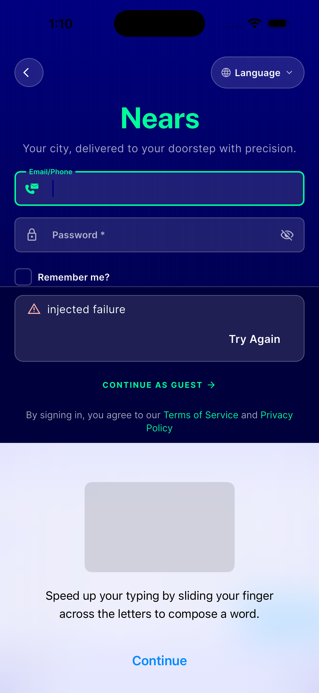
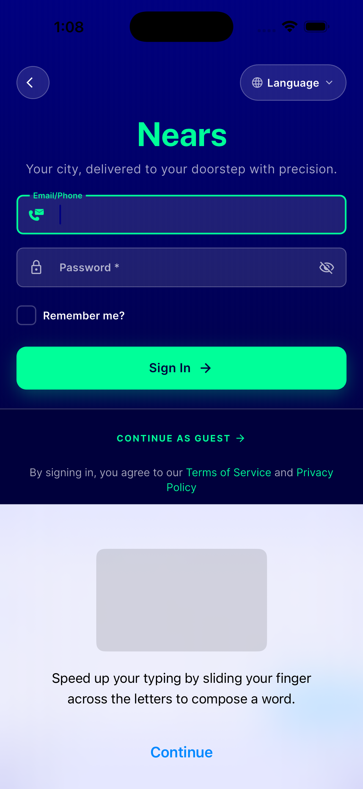
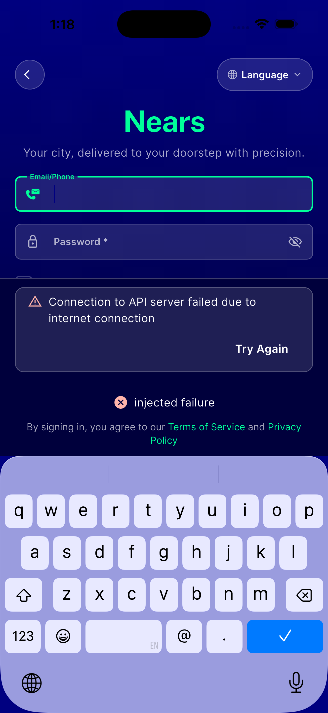

# QA Evidence — NEARS-1819

**PASS — guest-login toast/message fix verified live (iOS sim, 4/4 AC)**

**3 screenshot(s).** Click any thumbnail for full resolution.

<table>
<tr>
<td align="center" width="33%"> ac1 ac2 no toast server message</td>
<td align="center" width="33%"> ac1 before baseline</td>
<td align="center" width="33%"> ac3 toast live caught</td>
</tr>
</table>

### Other artifacts
- [`ac3-ensureguestsession-toast-plus-panel-semantics-dump.txt`](ac3-ensureguestsession-toast-plus-panel-semantics-dump.txt)
- [`ac4-transport-failure-classified-copy.log`](ac4-transport-failure-classified-copy.log)

---
*From `nears/docs/qa-evidence/NEARS-1819/` · public-repo scrub policy (no live secrets; verified clean).*
