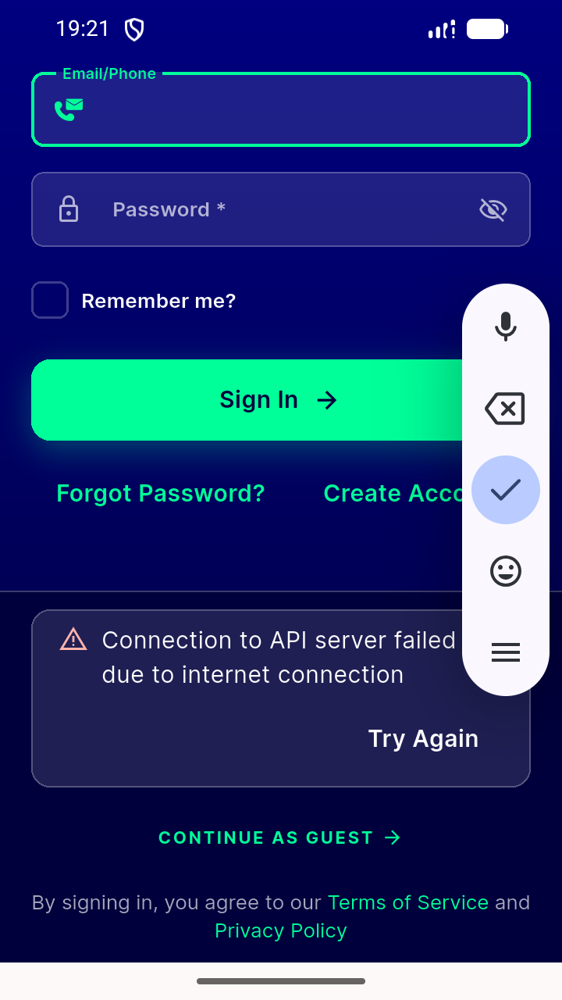
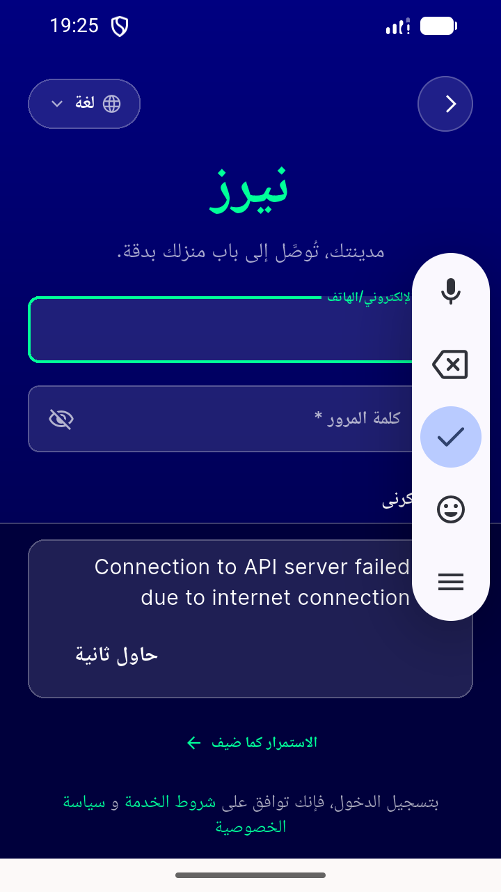
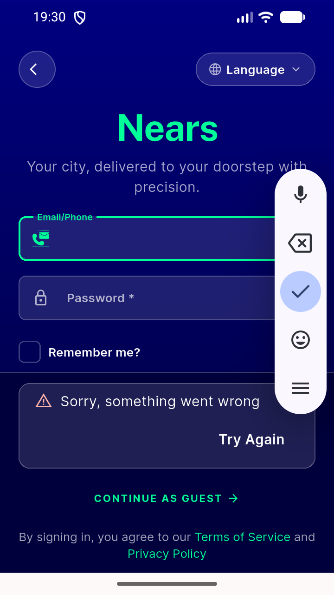
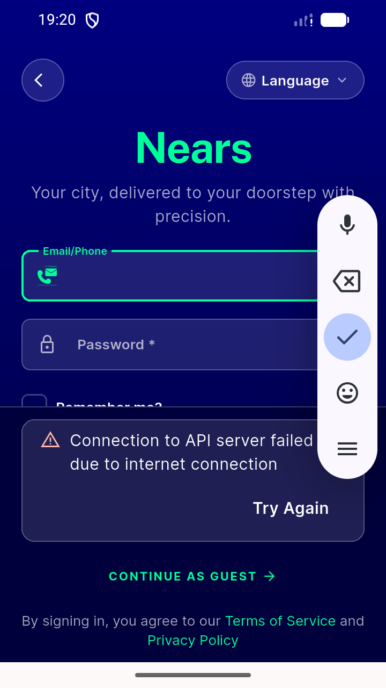
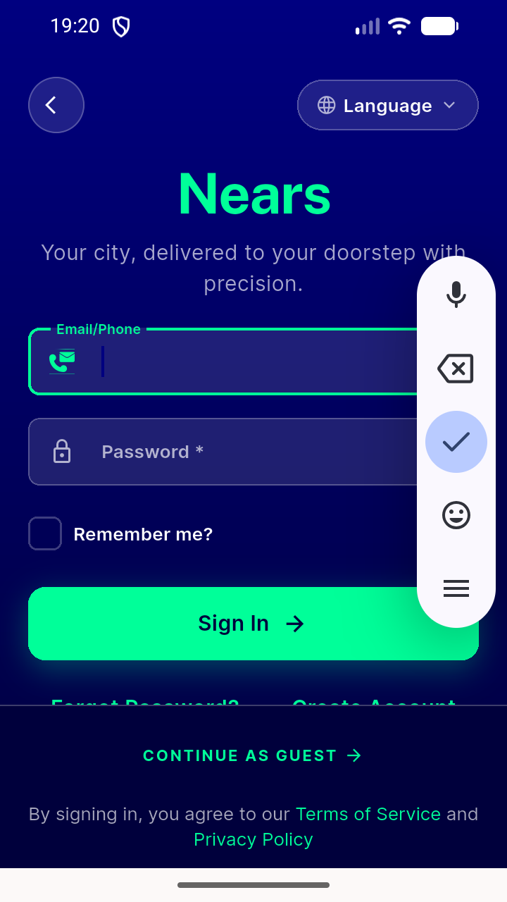
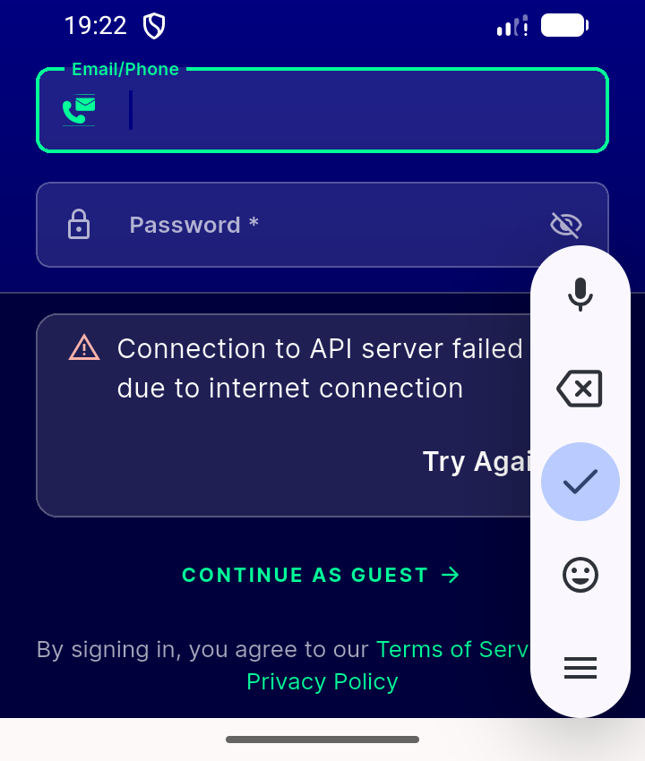
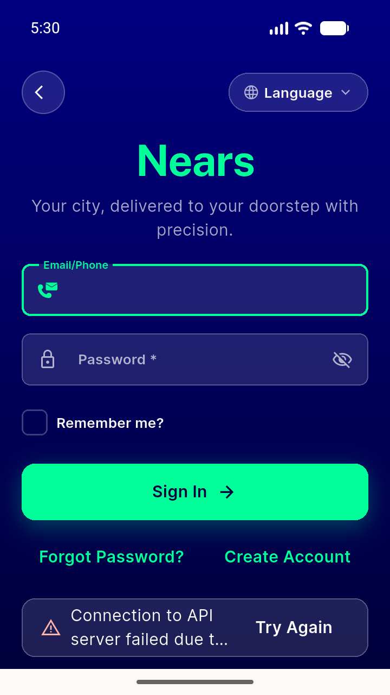

# QA Evidence — NEARS-1820

**fix-cycle 2 re-QA: PASS — CONTINUE AS GUEST visible at 360x640dp w/ failure panel, no occlusion of sign-in tail controls, RTL mirrors, retry >=44dp, no overflow**

**9 screenshot(s).** Click any thumbnail for full resolution.

<table>
<tr>
<td align="center" width="33%"> ac f1 scrolled tail controls visible</td>
<td align="center" width="33%"> ac rtl guest failure panel</td>
<td align="center" width="33%"> ac truncation proxy attempt fallback msg</td>
</tr>
<tr>
<td align="center" width="33%"> ac1 guest failure panel 360x640</td>
<td align="center" width="33%"> ac1 signin baseline 360x640</td>
<td align="center" width="33%"> ac2 keyboard shrink approx no overflow</td>
</tr>
<tr>
<td align="center" width="33%"> bug guest cta still below fold 360x640</td>
<td align="center" width="33%"> bug rtl message not localized</td>
<td align="center" width="33%"> final clean signin baseline</td>
</tr>
</table>

### Other artifacts
- [`ac1-below-fold-clip-dump.xml`](ac1-below-fold-clip-dump.xml)

---
*From `nears/docs/qa-evidence/NEARS-1820/` · public-repo scrub policy (no live secrets; verified clean).*
