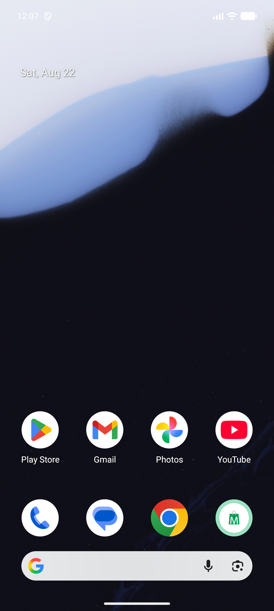
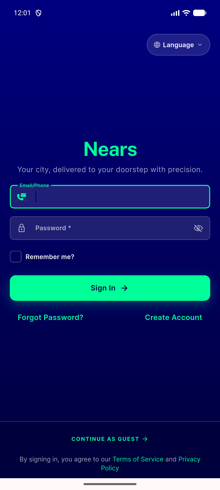
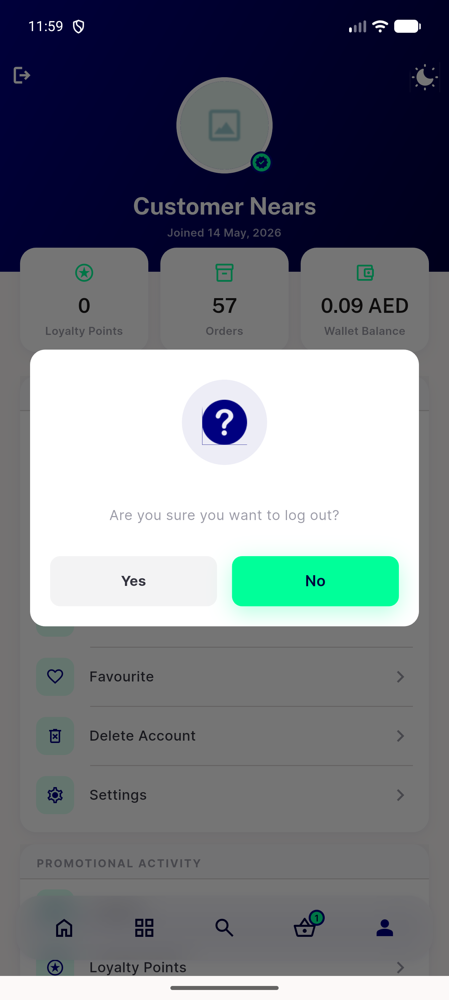
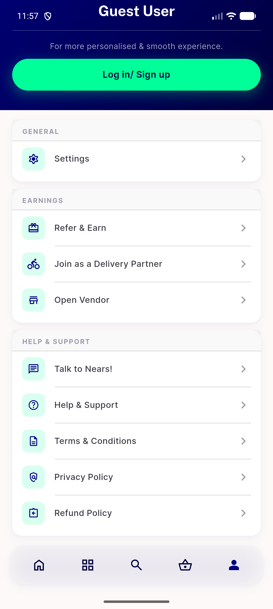
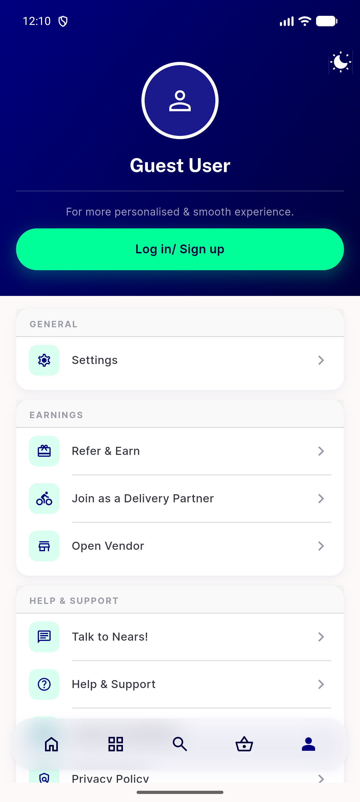
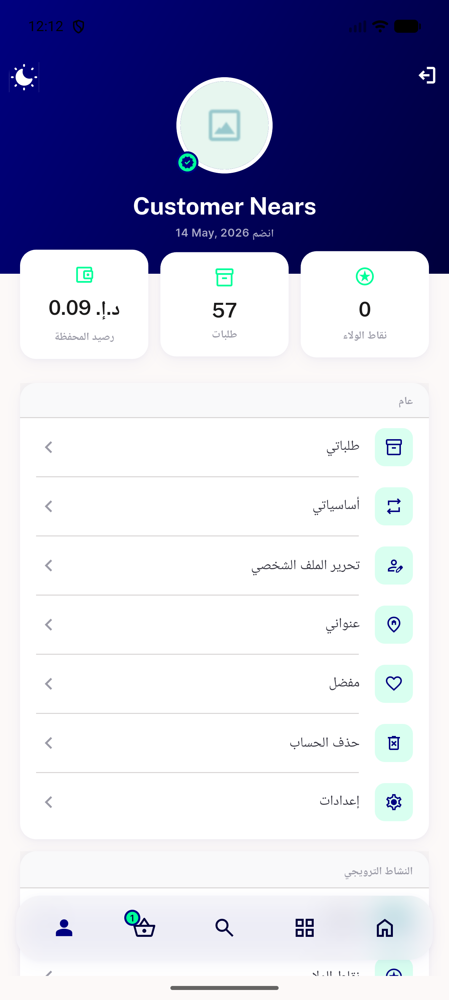

# QA Evidence — NEARS-1821

**PASS — NEARS-1821 MenuDrawer removal + hero exit icon, live QA emulator-5570**

**6 screenshot(s).** Click any thumbnail for full resolution.

<table>
<tr>
<td align="center" width="33%"> ac1 app backgrounded launcher</td>
<td align="center" width="33%"> ac1 back press again snackbar</td>
<td align="center" width="33%"> ac1 hero icon confirm dialog</td>
</tr>
<tr>
<td align="center" width="33%"> ac2 bottom logout regression getback stays on profile</td>
<td align="center" width="33%"> guest state no hero icon</td>
<td align="center" width="33%"> rtl icons swapped</td>
</tr>
</table>

### Other artifacts
- [`guest-state-no-hero-icon-dump.xml`](guest-state-no-hero-icon-dump.xml)

---
*From `nears/docs/qa-evidence/NEARS-1821/` · public-repo scrub policy (no live secrets; verified clean).*
