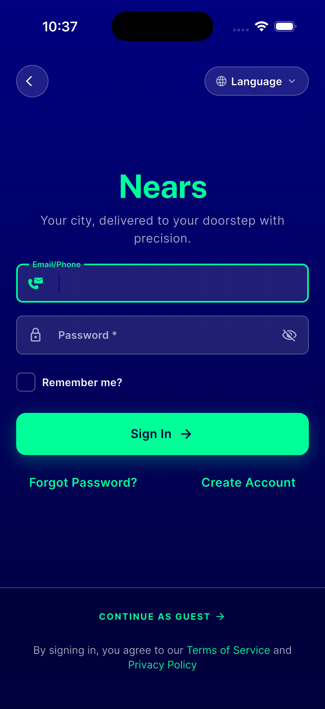
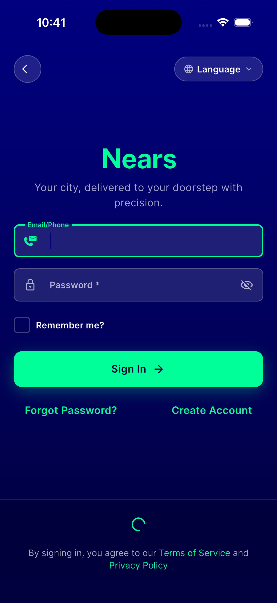

# QA Evidence — NEARS-1822

**PASS — AC1 guest-login try/finally live-verified (iOS sim, forced throw via local rewriting proxy), AC2 unchanged, regression clean**

**4 screenshot(s).** Click any thumbnail for full resolution.

<table>
<tr>
<td align="center" width="33%"> signin before</td>
<td align="center" width="33%"> guest throw during</td>
<td align="center" width="33%"> guest throw after</td>
</tr>
<tr>
<td align="center" width="33%"> signin after sweep</td>
</tr>
</table>

---
*From `nears/docs/qa-evidence/NEARS-1822/` · public-repo scrub policy (no live secrets; verified clean).*
