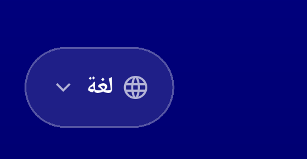
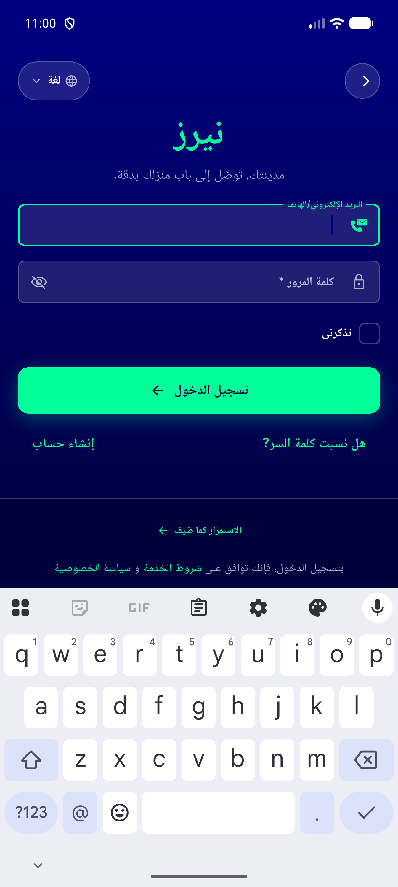
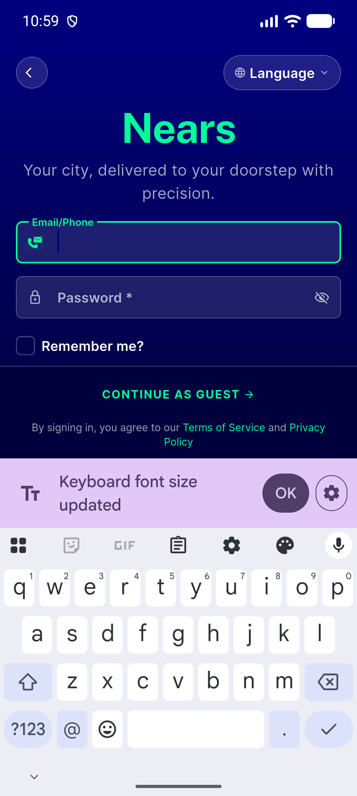
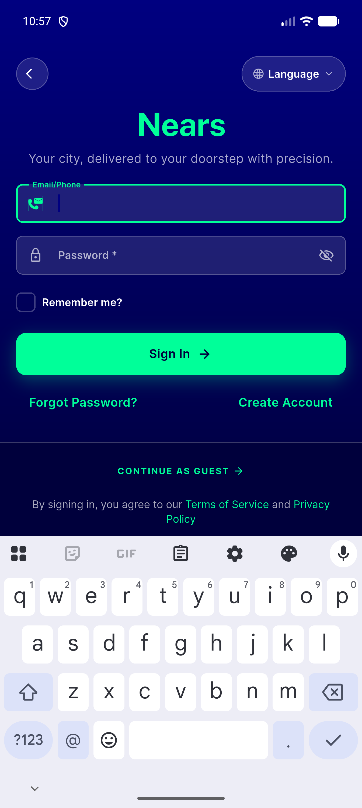

# QA Evidence — NEARS-1823

**PASS — language pill tap target raised to 44dp, opens language picker, centered content default+1.3x scale, RTL clean, Back button unaffected**

**8 screenshot(s).** Click any thumbnail for full resolution.

<table>
<tr>
<td align="center" width="33%"> ac1 signin pill 44dp</td>
<td align="center" width="33%"> ac2 language picker opened</td>
<td align="center" width="33%"> rtl arabic pill crop</td>
</tr>
<tr>
<td align="center" width="33%"> rtl arabic signin full</td>
<td align="center" width="33%"> visual centering 1.3x scale crop</td>
<td align="center" width="33%"> visual centering 1.3x scale full</td>
</tr>
<tr>
<td align="center" width="33%"> visual centering default scale crop</td>
<td align="center" width="33%"> visual centering default scale full</td>
</tr>
</table>

---
*From `nears/docs/qa-evidence/NEARS-1823/` · public-repo scrub policy (no live secrets; verified clean).*
