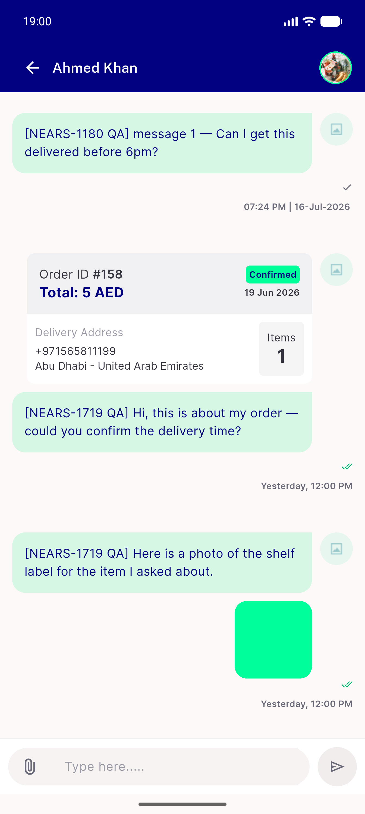
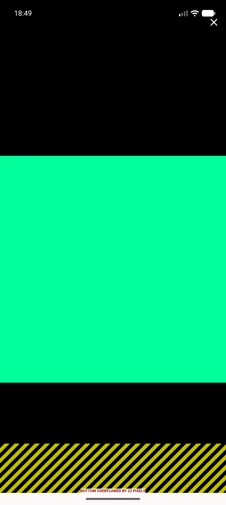

# QA Evidence — NEARS-1829

**NEARS-1829 QA: AC1 zero-overflow PROVEN on 3 qualified instruments; AC2 close PASS, arrows NOT TESTED, page indicator FAIL-as-written**

**4 screenshot(s).** Click any thumbnail for full resolution.

<table>
<tr>
<td align="center" width="33%"> ac1 postfix lightbox no overflow</td>
<td align="center" width="33%"> ac2 close topedge tap popped back to chat</td>
<td align="center" width="33%"> ac2 postfix close below statusbar</td>
</tr>
<tr>
<td align="center" width="33%"> control prefix lightbox overflow 22px</td>
</tr>
</table>

### Other artifacts
- [`control-positive-and-postfix-measurement.log`](control-positive-and-postfix-measurement.log)
- [`progress.md`](progress.md)

---
*From `nears/docs/qa-evidence/NEARS-1829/` · public-repo scrub policy (no live secrets; verified clean).*
