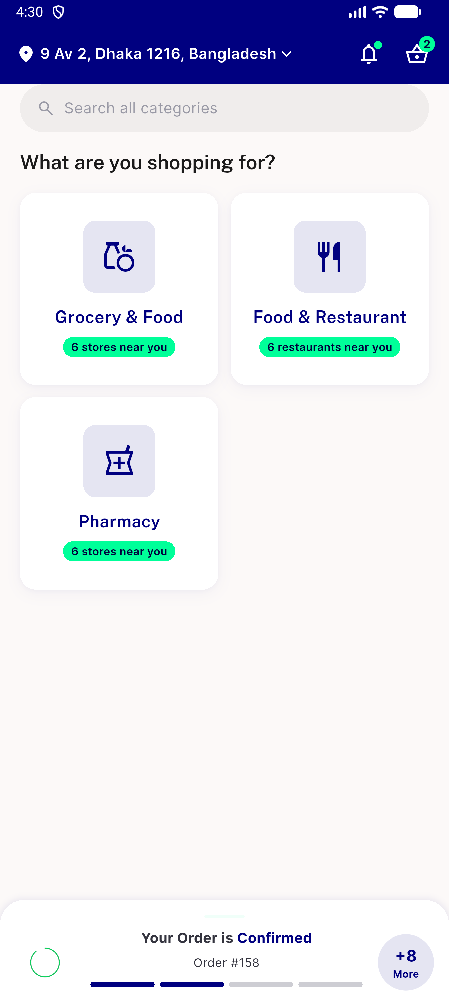
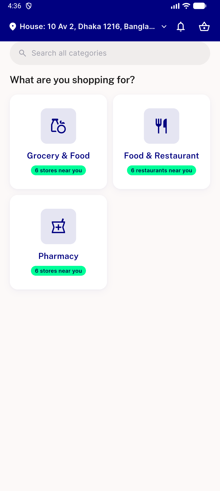

# QA Evidence — NEARS-1831

**NEGATIVE CONTROL HELD — module-selection landing has no bottom nav and no profile/account/menu affordance, in both tracker and no-tracker states (emulator-5560, UserApp debug, feat/userapp-reskin2 @ fa3a77ca)**

**2 screenshot(s).** Click any thumbnail for full resolution.

<table>
<tr>
<td align="center" width="33%"> module selection with active order tracker</td>
<td align="center" width="33%"> module selection no tracker card</td>
</tr>
</table>

---
*From `nears/docs/qa-evidence/NEARS-1831/` · public-repo scrub policy (no live secrets; verified clean).*
