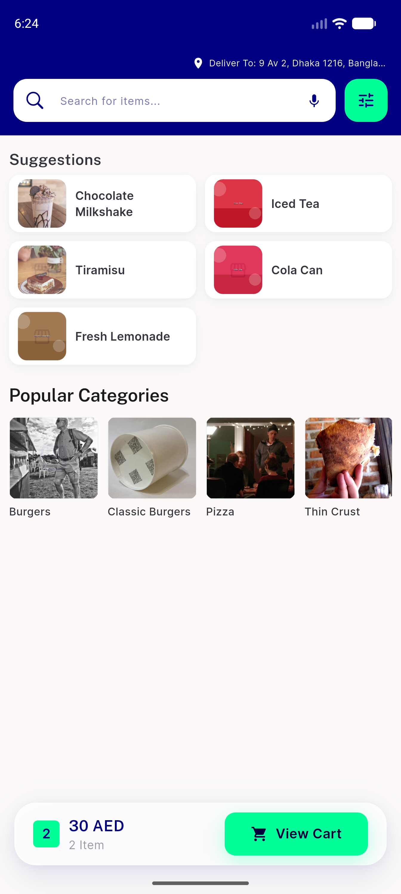
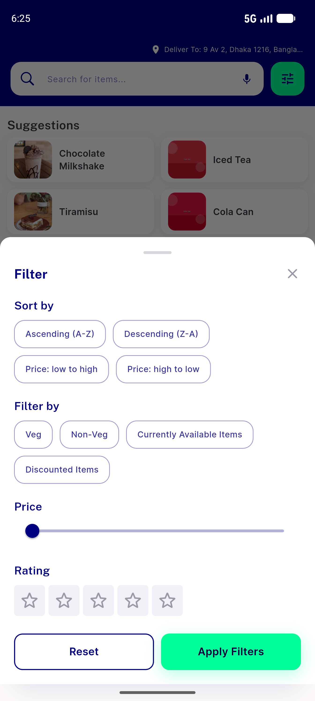
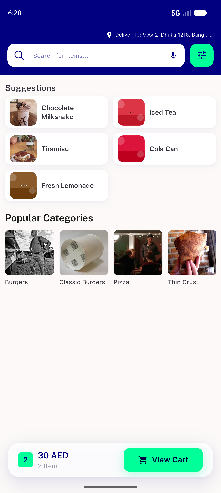
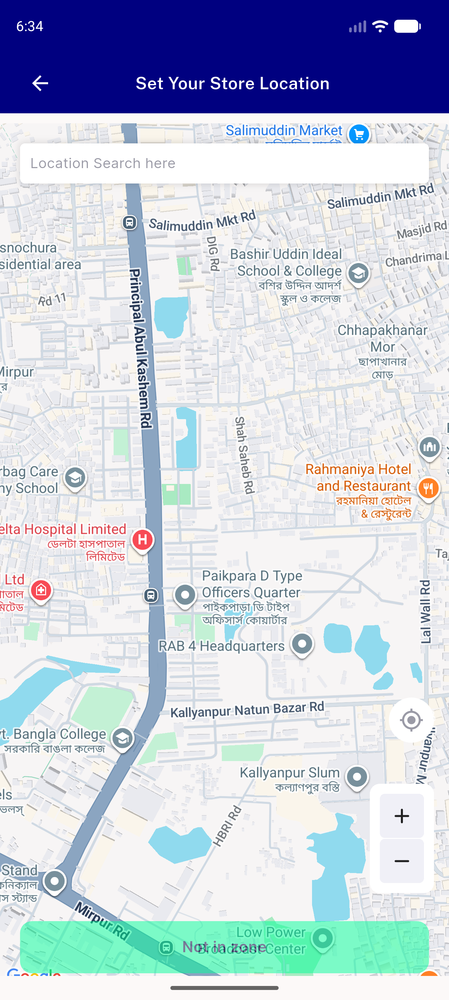
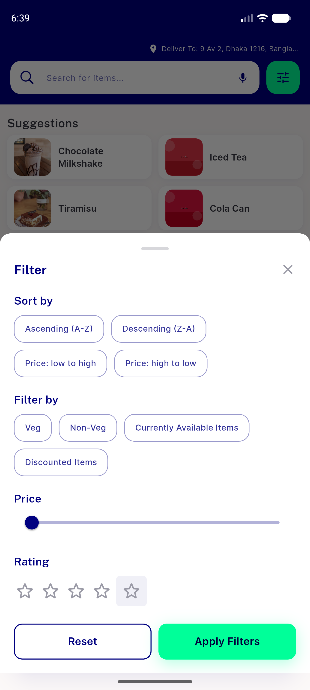

# QA Evidence — NEARS-1837

**NEARS-1837 QA PASS — NEARS-963 a11y claim REFUTED: bare 32dp Semantics>InkWell>Icon stars project their labels; AC1 baseline 44dp stars + map zoom also project**

**11 screenshot(s).** Click any thumbnail for full resolution.

<table>
<tr>
<td align="center" width="33%"> launch</td>
<td align="center" width="33%"> search screen</td>
<td align="center" width="33%"> 01b search screen now</td>
</tr>
<tr>
<td align="center" width="33%"> module home</td>
<td align="center" width="33%"> module search</td>
<td align="center" width="33%"> AC1 filter sheet</td>
</tr>
<tr>
<td align="center" width="33%"> nav state</td>
<td align="center" width="33%"> home</td>
<td align="center" width="33%"> store registration</td>
</tr>
<tr>
<td align="center" width="33%"> AC1 fullscreen map</td>
<td align="center" width="33%"> AC2 experiment sheet</td>
</tr>
</table>

### Other artifacts
- [`bug-map-expand-control-unlabelled.log`](bug-map-expand-control-unlabelled.log)
- [`dumps`](dumps)
- [`progress.md`](progress.md)

---
*From `nears/docs/qa-evidence/NEARS-1837/` · public-repo scrub policy (no live secrets; verified clean).*
