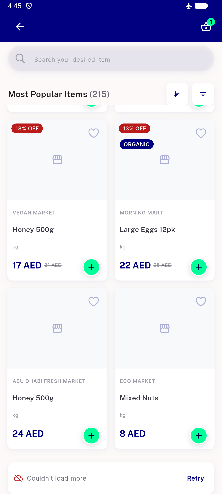
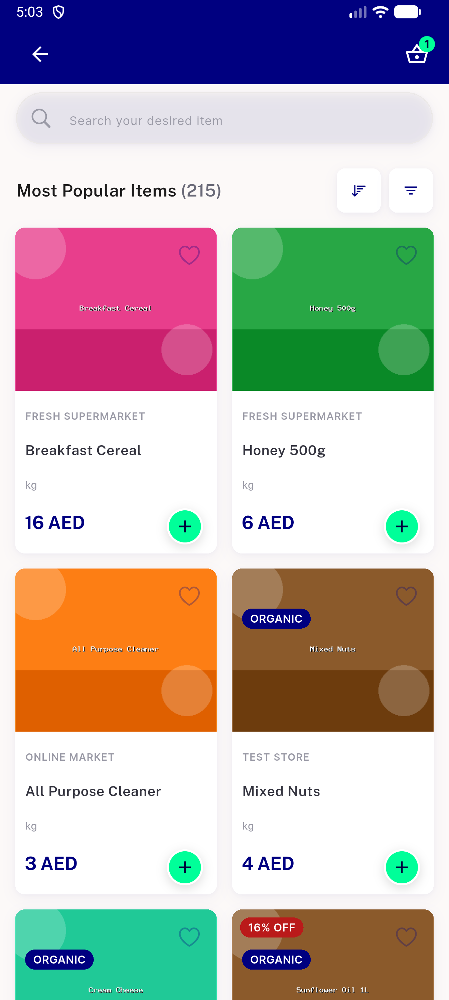
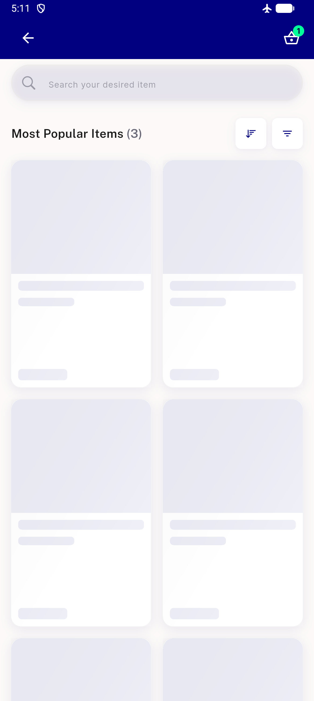
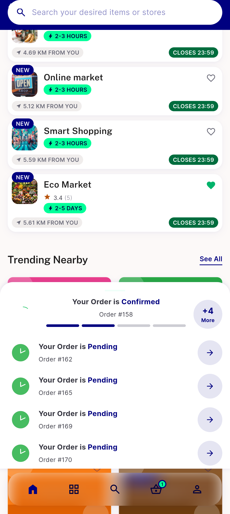
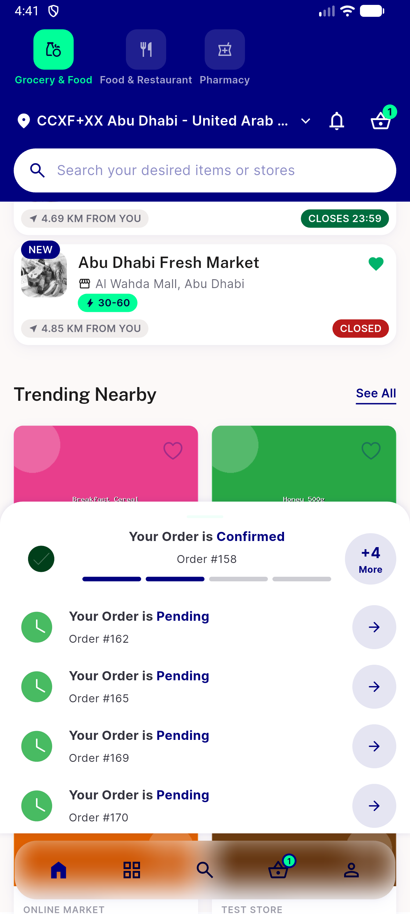

# QA Evidence — NEARS-1840

**PASS (5/6 ACs demonstrated; AC4 unreachable by construction) — UserApp load-more failure recovery, emulator-5560, APK md5 27750f3702db7887e8399f1ca119707c**

**5 screenshot(s).** Click any thumbnail for full resolution.

<table>
<tr>
<td align="center" width="33%"> ac1 inline error row over grid</td>
<td align="center" width="33%"> ac2 retry appended page</td>
<td align="center" width="33%"> ac5 page1 failure shimmer no error row</td>
</tr>
<tr>
<td align="center" width="33%"> q0 trending after pull refresh</td>
<td align="center" width="33%"> q0 trending nearby rendered</td>
</tr>
</table>

---
*From `nears/docs/qa-evidence/NEARS-1840/` · public-repo scrub policy (no live secrets; verified clean).*
