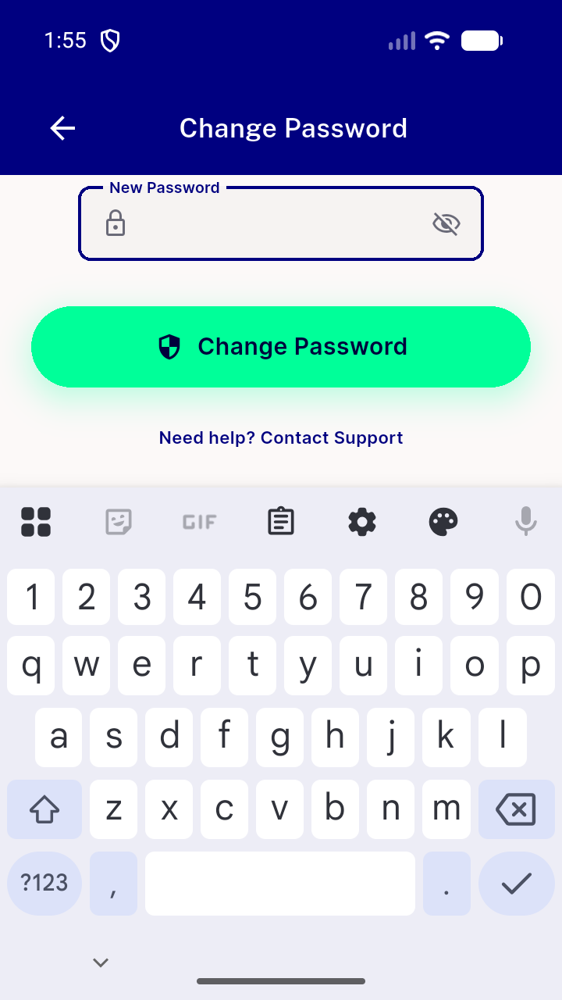
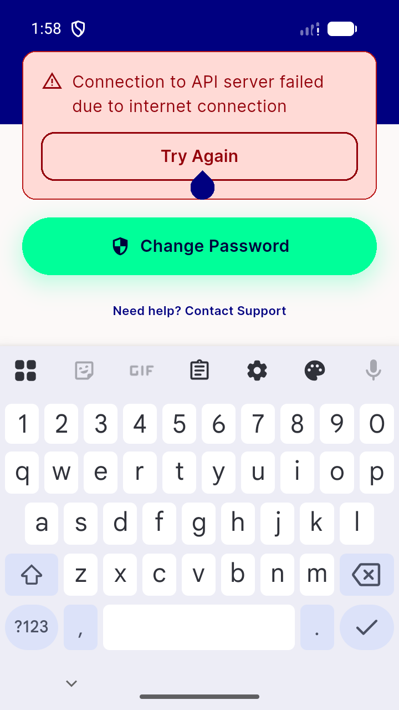
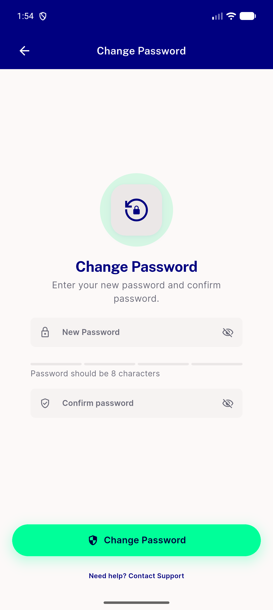
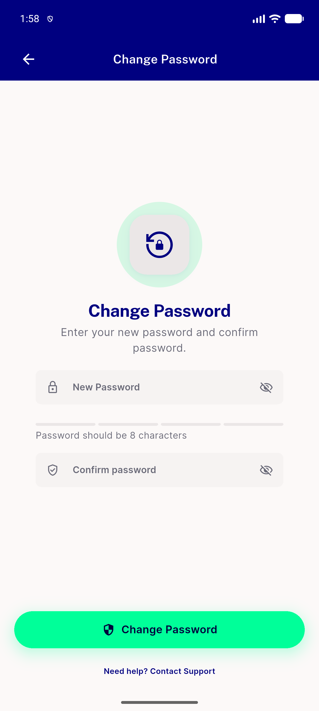
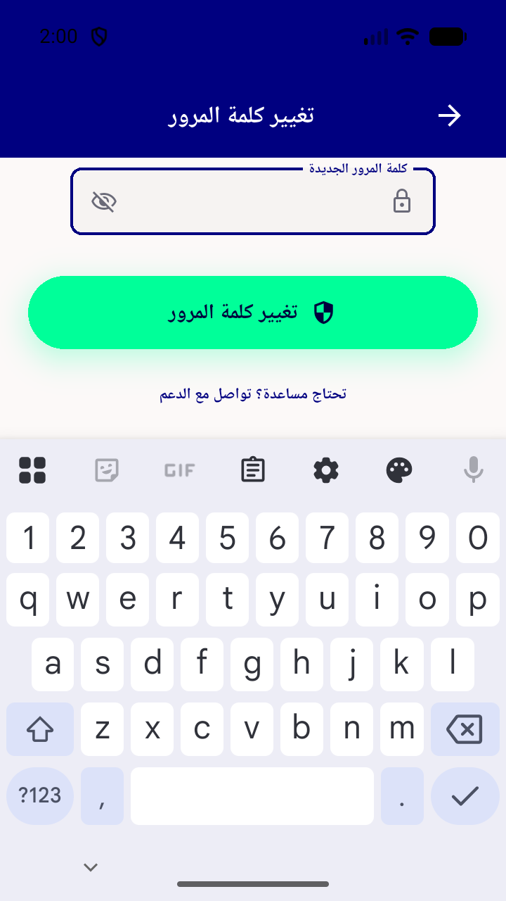

# QA Evidence — NEARS-1842

**PASS — keyboard-raised bottom bar fix verified live at 360x640dp + RTL; reset-token path structurally unreachable (NEARS-1748), backed by 30/30 widget tests**

**5 screenshot(s).** Click any thumbnail for full resolution.

<table>
<tr>
<td align="center" width="33%"> ac1 360x640 keyboard raised changepw</td>
<td align="center" width="33%"> ac1 360x640 keyboard raised failurepanel</td>
<td align="center" width="33%"> ac3 default geometry keyboard down</td>
</tr>
<tr>
<td align="center" width="33%"> ac3 default geometry postfix clean</td>
<td align="center" width="33%"> rtl 360x640 keyboard raised</td>
</tr>
</table>

### Other artifacts
- [`bug-facebook-graph-oauth-deleted-app.log`](bug-facebook-graph-oauth-deleted-app.log)

---
*From `nears/docs/qa-evidence/NEARS-1842/` · public-repo scrub policy (no live secrets; verified clean).*
