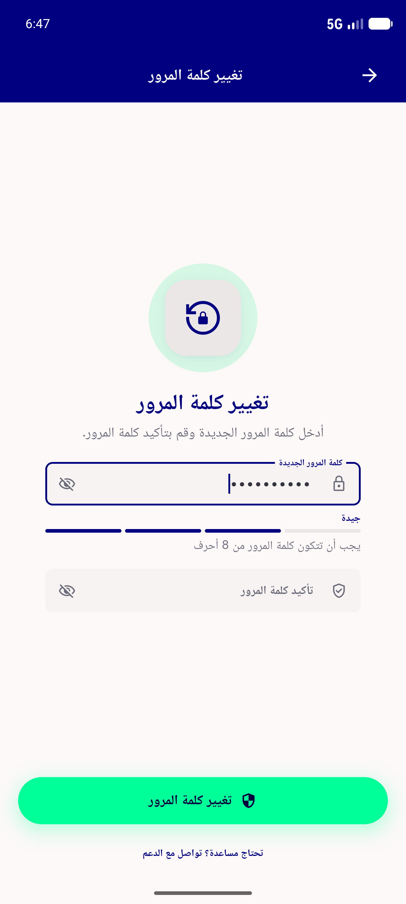
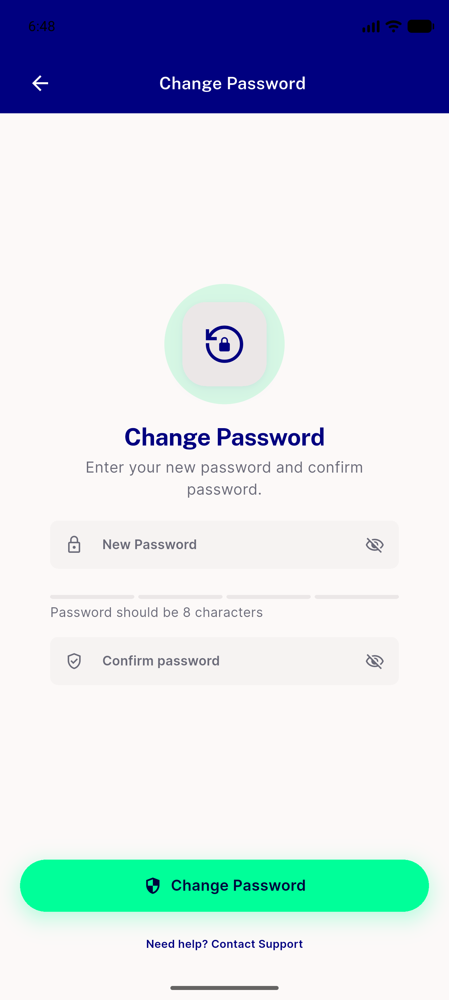
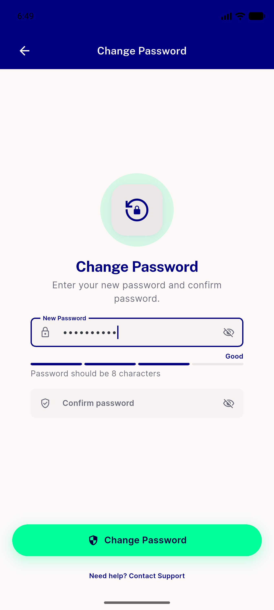

# QA Evidence — NEARS-1843

**PASS - a11y semanticLabel translation verified live in Arabic + English, no visual/behavioral regression**

**3 screenshot(s).** Click any thumbnail for full resolution.

<table>
<tr>
<td align="center" width="33%"> ar new pass typed</td>
<td align="center" width="33%"> en new pass empty</td>
<td align="center" width="33%"> en new pass typed</td>
</tr>
</table>

### Other artifacts
- [`ac1-newpass-ar-empty-dump.xml`](ac1-newpass-ar-empty-dump.xml)
- [`ac1-newpass-ar-typed-dump.xml`](ac1-newpass-ar-typed-dump.xml)
- [`ac2-newpass-en-empty-dump.xml`](ac2-newpass-en-empty-dump.xml)
- [`ac2-newpass-en-typed-dump.xml`](ac2-newpass-en-typed-dump.xml)

---
*From `nears/docs/qa-evidence/NEARS-1843/` · public-repo scrub policy (no live secrets; verified clean).*
