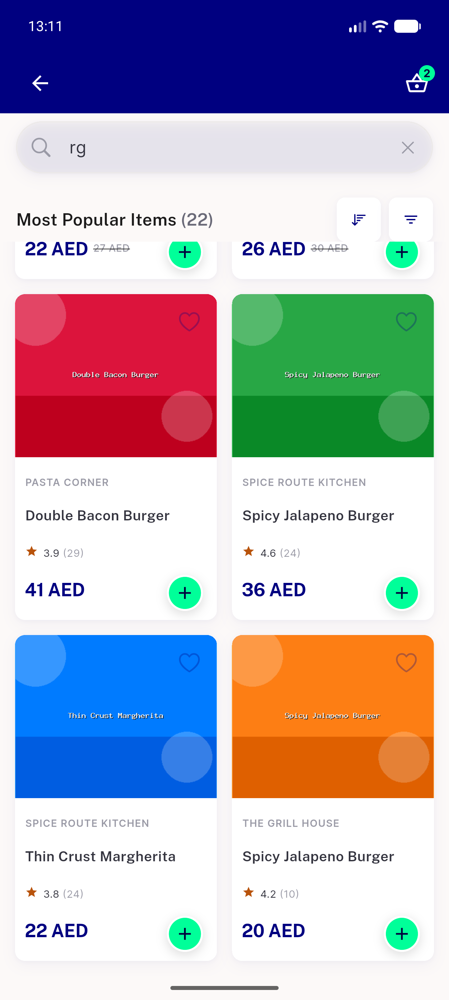
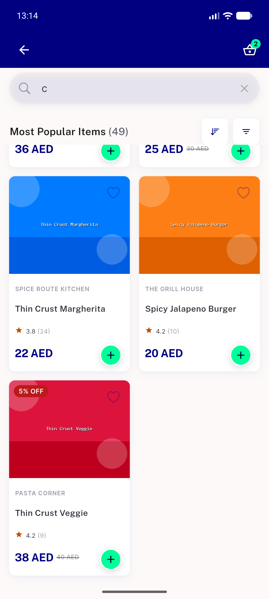

# QA Evidence — NEARS-1844

**PASS — AC1/AC2 static+wire, AC3 Item half live (3 fixtures + positive control), Brands half unreachable by construction (NOT TESTED)**

**3 screenshot(s).** Click any thumbnail for full resolution.

<table>
<tr>
<td align="center" width="33%"> ac3 window22 bottom no extra page</td>
<td align="center" width="33%"> ac3 window49 one loadmore</td>
<td align="center" width="33%"> regr buy it again rail populated</td>
</tr>
</table>

### Other artifacts
- [`progress.md`](progress.md)
- [`wire-trace.log`](wire-trace.log)

---
*From `nears/docs/qa-evidence/NEARS-1844/` · public-repo scrub policy (no live secrets; verified clean).*
