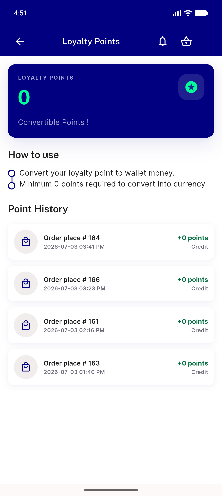
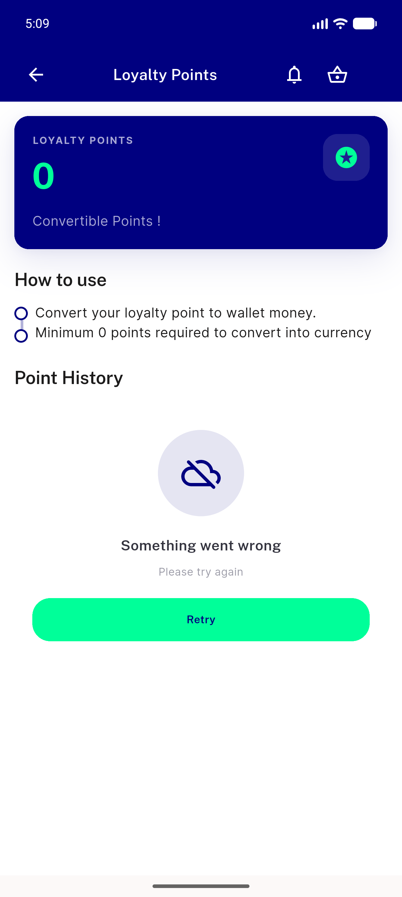
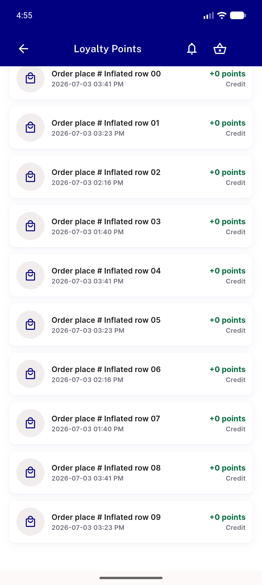

# QA Evidence — NEARS-1845

**PASS — NEARS-1845: exactly 1 [FAIL] per failed load on both reachable paths; plus a measured non-blocking silent band (201..399)**

**6 screenshot(s).** Click any thumbnail for full resolution.

<table>
<tr>
<td align="center" width="33%"> ac control healthy loyalty</td>
<td align="center" width="33%"> ac1 500 one fail</td>
<td align="center" width="33%"> ac1 abort one fail</td>
</tr>
<tr>
<td align="center" width="33%"> ac2 retry recovers</td>
<td align="center" width="33%"> bug silent 204 band</td>
<td align="center" width="33%"> regression loadmore page2 fail</td>
</tr>
</table>

### Other artifacts
- [`bug-silent-2xx-3xx-band.log`](bug-silent-2xx-3xx-band.log)

---
*From `nears/docs/qa-evidence/NEARS-1845/` · public-repo scrub policy (no live secrets; verified clean).*
