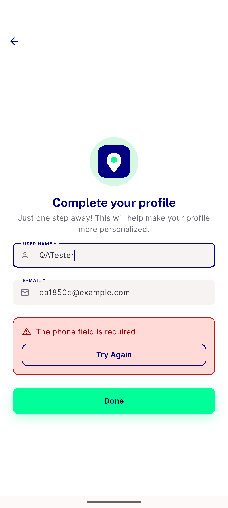

# QA Evidence — NEARS-1850

**PASS-with-caveat: AC1/AC4/AC5 code+unit-confirmed, AC3 confirmed LIVE (both a real and a synthetic-avoided negative control), AC2/ux-f1 social-branch routing unverifiable-live (no social OAuth entry point in this env) but widget-test+static-confirmed**

**1 screenshot(s).** Click any thumbnail for full resolution.

<table>
<tr>
<td align="center" width="33%"> ac3 nonsocial phonecoded panel</td>
</tr>
</table>

### Other artifacts
- [`progress.md`](progress.md)

---
*From `nears/docs/qa-evidence/NEARS-1850/` · public-repo scrub policy (no live secrets; verified clean).*
