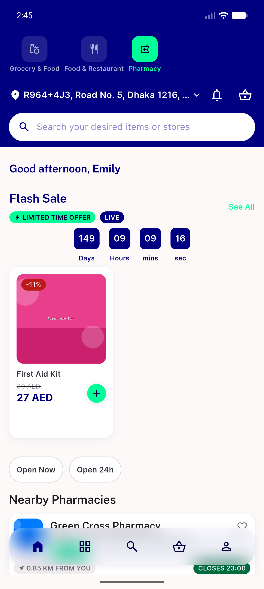

# QA Evidence — NEARS-1862

**PASS — TOCTOU module guard verified live on emulator-5558: AC-1/B1/B2 skips positively observed by rail-call absence; normal paths clean on grocery/food/pharmacy; 3947 tests 0 fail**

**5 screenshot(s).** Click any thumbnail for full resolution.

<table>
<tr>
<td align="center" width="33%"> ac normal food refresh</td>
<td align="center" width="33%"> ac normal grocery cold open</td>
<td align="center" width="33%"> ac normal pharmacy refresh</td>
</tr>
<tr>
<td align="center" width="33%"> ac1 01 sector picker after backout</td>
<td align="center" width="33%"> b1 01 spinner during refresh</td>
</tr>
</table>

### Other artifacts
- [`ac1-fetchmoduleblock-skip.log`](ac1-fetchmoduleblock-skip.log)
- [`ac2-b1-b2-refreshhomedata-skip.log`](ac2-b1-b2-refreshhomedata-skip.log)
- [`regression-normal-paths.log`](regression-normal-paths.log)

---
*From `nears/docs/qa-evidence/NEARS-1862/` · public-repo scrub policy (no live secrets; verified clean).*
