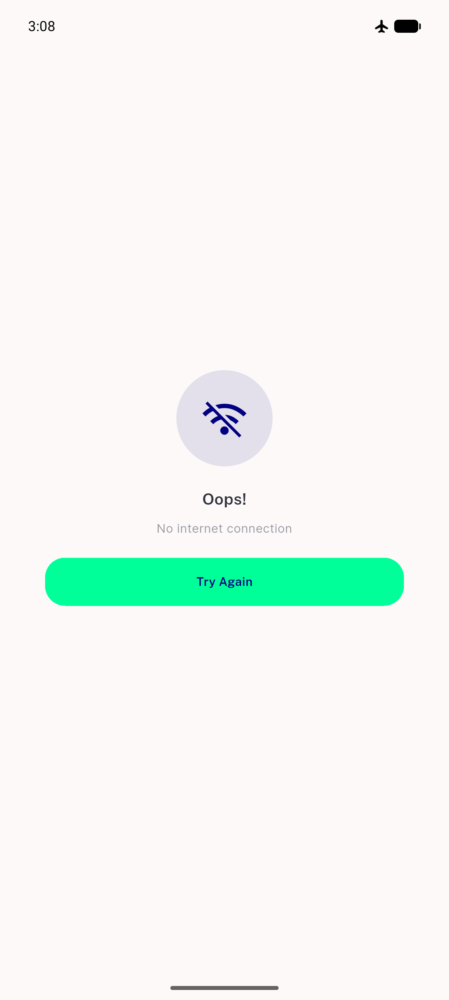

# QA Evidence — NEARS-1863

**PASS (with 3 of 6 device scenarios blocked by absent campaign seed data) — c06e48a4 on emulator-5558, light mode**

**2 screenshot(s).** Click any thumbnail for full resolution.

<table>
<tr>
<td align="center" width="33%"> home food module post fix</td>
<td align="center" width="33%"> offline cold start graceful</td>
</tr>
</table>

### Other artifacts
- [`bug-campaign-seed-data-absent.log`](bug-campaign-seed-data-absent.log)
- [`campaign-endpoint-independence.log`](campaign-endpoint-independence.log)

---
*From `nears/docs/qa-evidence/NEARS-1863/` · public-repo scrub policy (no live secrets; verified clean).*
