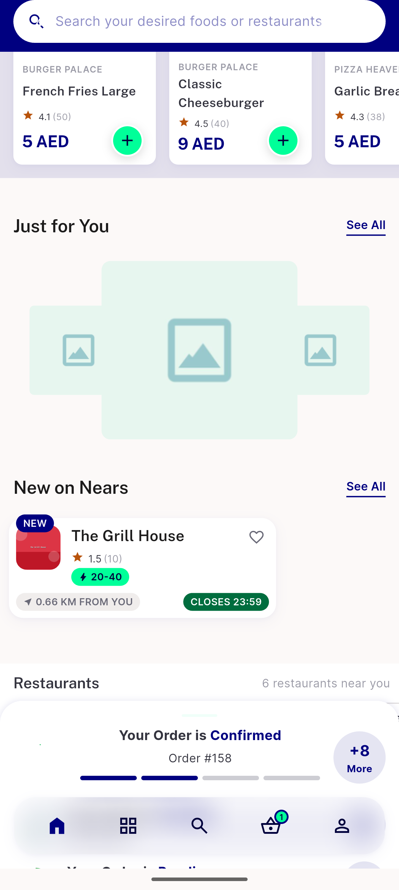
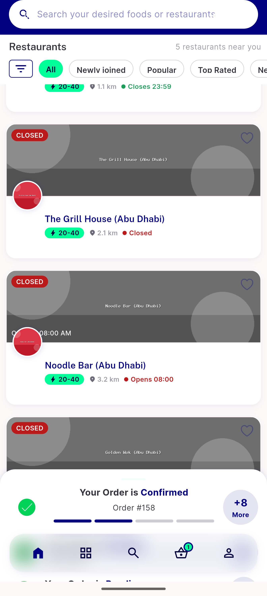
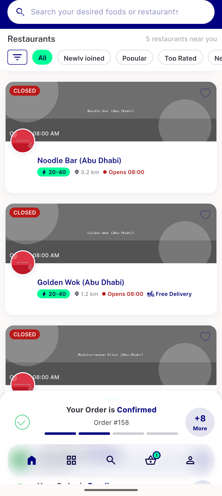

# QA Evidence — NEARS-1864

**PASS — item_campaigns seed renders JustForYouView populated (zone1/food) + navigates to ItemCampaignScreen; empty-state confirmed clean (zone2/food)**

**4 screenshot(s).** Click any thumbnail for full resolution.

<table>
<tr>
<td align="center" width="33%"> ac2 home just for you populated</td>
<td align="center" width="33%"> ac2 item campaign screen tasty food favorites</td>
<td align="center" width="33%"> ac3 zone2 food absence confirmed</td>
</tr>
<tr>
<td align="center" width="33%"> ac3 zone2 food empty state no jfy</td>
</tr>
</table>

### Other artifacts
- [`ac3-zone2-food-absence-dump.xml`](ac3-zone2-food-absence-dump.xml)

---
*From `nears/docs/qa-evidence/NEARS-1864/` · public-repo scrub policy (no live secrets; verified clean).*
