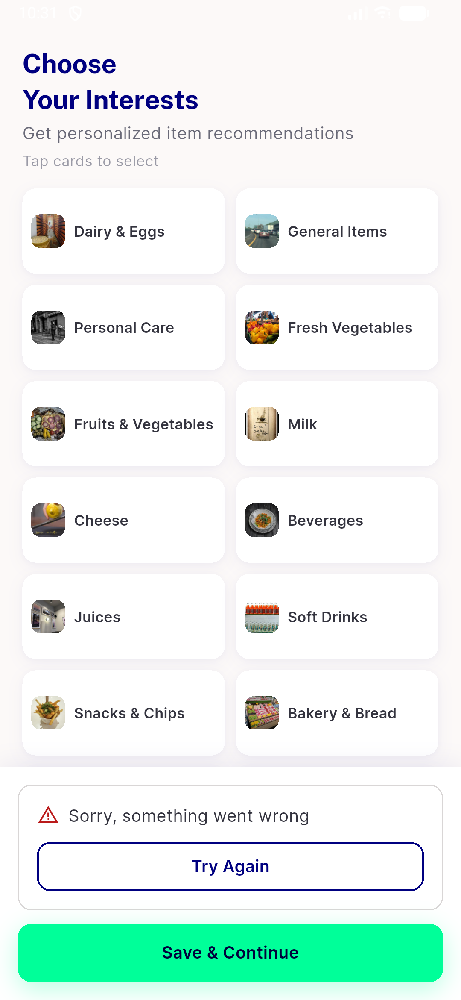
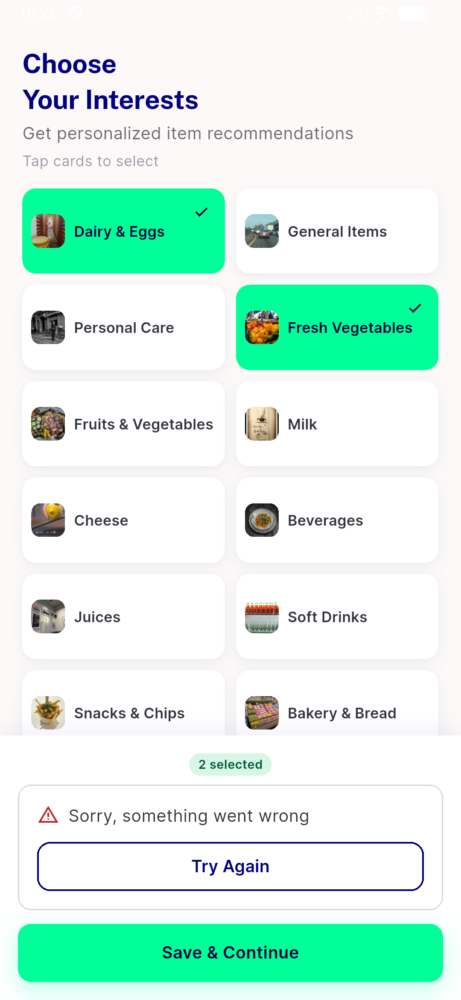
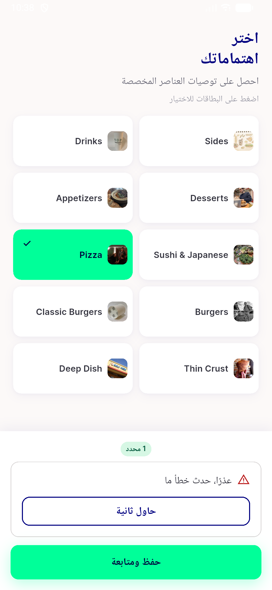

# QA Evidence — NEARS-1867

**PASS with 1 non-blocking task_bug (double-tap retry race) — all 5 ACs demonstrated live**

**3 screenshot(s).** Click any thumbnail for full resolution.

<table>
<tr>
<td align="center" width="33%"> ac zero retry panel before skip</td>
<td align="center" width="33%"> ac1 3 fail panel selection preserved</td>
<td align="center" width="33%"> rtl error panel</td>
</tr>
</table>

### Other artifacts
- [`bug-double-tap-retry-duplicate-post.log`](bug-double-tap-retry-duplicate-post.log)

---
*From `nears/docs/qa-evidence/NEARS-1867/` · public-repo scrub policy (no live secrets; verified clean).*
