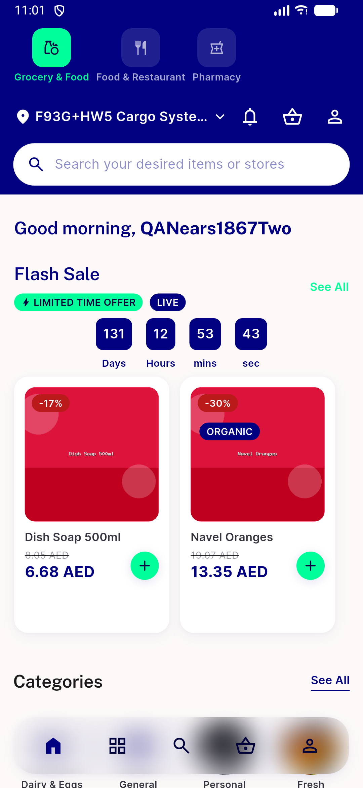

# QA Evidence — NEARS-1867

**PASS - NEARS-2814 delta re-QA: same-frame double-touch guard closes duplicate POST on interest retry (6/6 trials clean), HEAD cda844675**

**4 screenshot(s).** Click any thumbnail for full resolution.

<table>
<tr>
<td align="center" width="33%"> ac 2814 post retry home</td>
<td align="center" width="33%"> ac zero retry panel before skip</td>
<td align="center" width="33%"> ac1 3 fail panel selection preserved</td>
</tr>
<tr>
<td align="center" width="33%"> rtl error panel</td>
</tr>
</table>

### Other artifacts
- [`bug-double-tap-retry-duplicate-post.log`](bug-double-tap-retry-duplicate-post.log)
- [`nears-2814-doubletap-6trials.log`](nears-2814-doubletap-6trials.log)

---
*From `nears/docs/qa-evidence/NEARS-1867/` · public-repo scrub policy (no live secrets; verified clean).*
