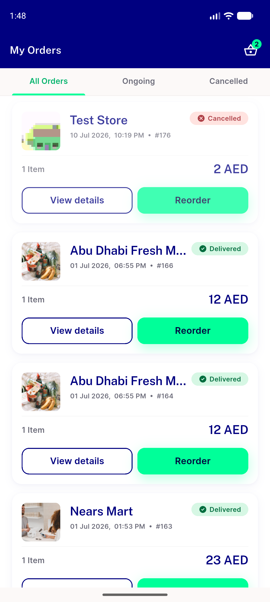

# QA Evidence — NEARS-1868

**PASS — 201/204/399 band closed; 500 positive control fired same-run; 3849 tests green**

**1 screenshot(s).** Click any thumbnail for full resolution.

<table>
<tr>
<td align="center" width="33%"> ac2 403 single toast single fail</td>
</tr>
</table>

### Other artifacts
- [`ac1-band-live-device.log`](ac1-band-live-device.log)
- [`browse-noise-clean.log`](browse-noise-clean.log)
- [`harness-mutation-battery.log`](harness-mutation-battery.log)
- [`smoke-401-force-logout.log`](smoke-401-force-logout.log)
- [`smoke-403-single-toast.log`](smoke-403-single-toast.log)

---
*From `nears/docs/qa-evidence/NEARS-1868/` · public-repo scrub policy (no live secrets; verified clean).*
