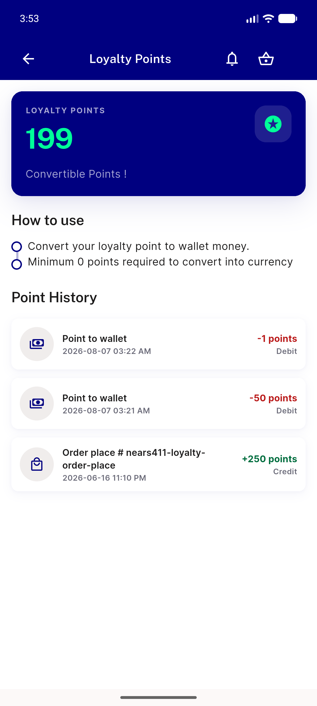
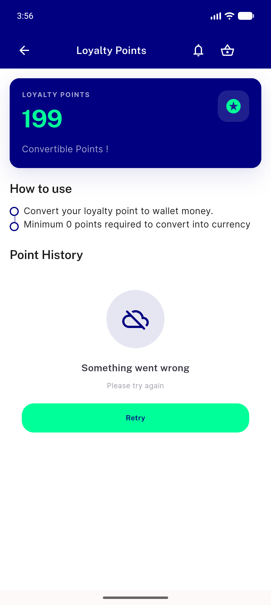
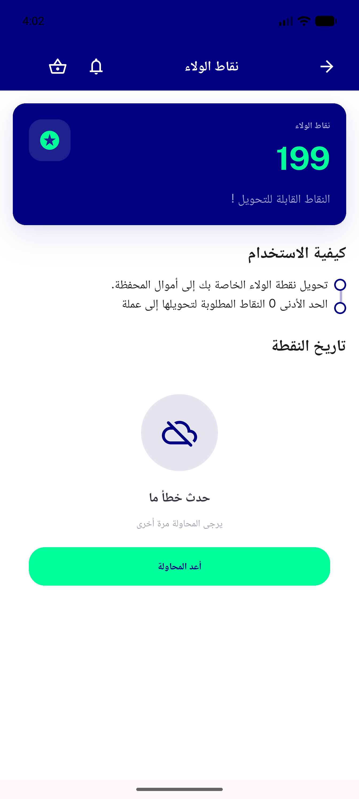

# QA Evidence — NEARS-1869

**PASS — NEARS-1869 non-JSON 200 guard: AC1 demonstrated live via injected HTML 200; regression sweep clean**

**3 screenshot(s).** Click any thumbnail for full resolution.

<table>
<tr>
<td align="center" width="33%"> ac happy path loyalty history</td>
<td align="center" width="33%"> ac1 nonjson200 error retry</td>
<td align="center" width="33%"> rtl arabic loyalty error retry</td>
</tr>
</table>

### Other artifacts
- [`bug-none-ac1-fail-line.log`](bug-none-ac1-fail-line.log)
- [`bug-pointtowallet-unguarded-nonjson-200.log`](bug-pointtowallet-unguarded-nonjson-200.log)
- [`failure-paths-one-line-each.log`](failure-paths-one-line-each.log)
- [`rtl-geometry-proof.txt`](rtl-geometry-proof.txt)

---
*From `nears/docs/qa-evidence/NEARS-1869/` · public-repo scrub policy (no live secrets; verified clean).*
