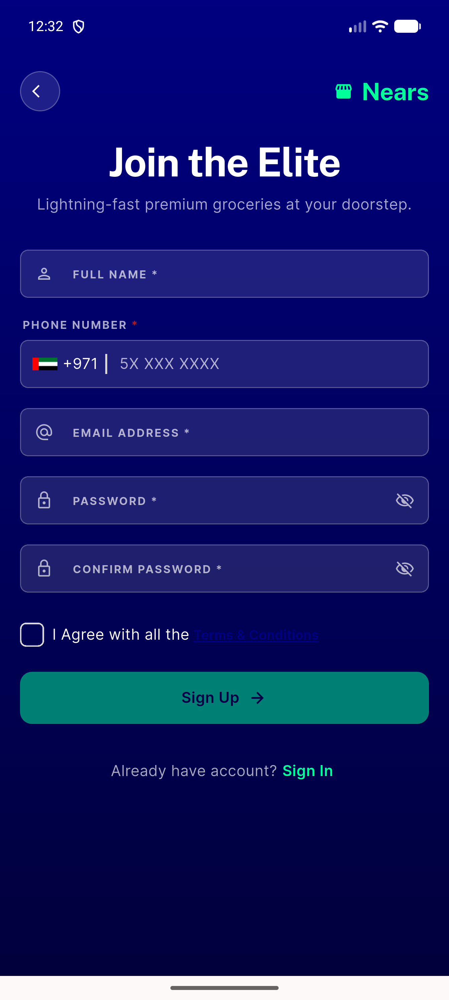

# QA Evidence — NEARS-1871

**PASS - hero back button always renders + works after exitFromApp dead-param removal (device emulator-5554)**

**1 screenshot(s).** Click any thumbnail for full resolution.

<table>
<tr>
<td align="center" width="33%"> signup hero back button</td>
</tr>
</table>

---
*From `nears/docs/qa-evidence/NEARS-1871/` · public-repo scrub policy (no live secrets; verified clean).*
