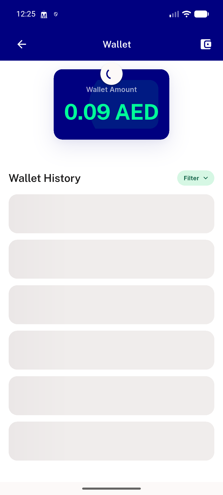
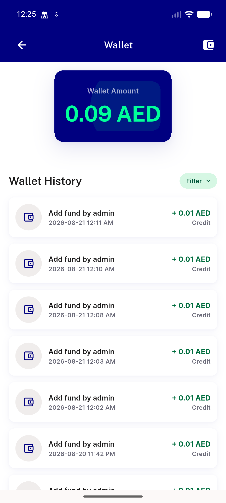

# QA Evidence — NEARS-1872

**PASS — RefreshIndicator awaits both wallet calls (getWalletTransactionList + getUserInfo), verified live with a stalled backend; automated test + filter-preserving regression clean**

**3 screenshot(s).** Click any thumbnail for full resolution.

<table>
<tr>
<td align="center" width="33%"> ac1 normal refresh retracts</td>
<td align="center" width="33%"> ac1 refresh spinner held while stalled</td>
<td align="center" width="33%"> ac1 refresh spinner retracts after resolve</td>
</tr>
</table>

---
*From `nears/docs/qa-evidence/NEARS-1872/` · public-repo scrub policy (no live secrets; verified clean).*
