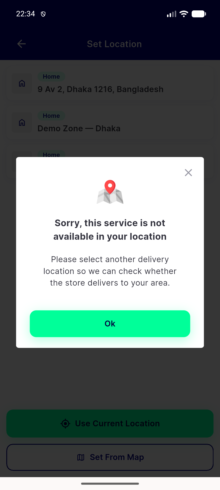

# QA Evidence — NEARS-1873

**PASS - live barrier proof on emulator-5562, AC1 literal repro blocked by unrelated wallet defect (regression_bug filed)**

**1 screenshot(s).** Click any thumbnail for full resolution.

<table>
<tr>
<td align="center" width="33%"> zonewarningdialog barrier rc5</td>
</tr>
</table>

### Other artifacts
- [`bug-wallet-tile-unreachable.log`](bug-wallet-tile-unreachable.log)
- [`device-pool-blocked-20260820.txt`](device-pool-blocked-20260820.txt)
- [`live-qa-emulator-5562-20260820.txt`](live-qa-emulator-5562-20260820.txt)
- [`wallet-filter-popup-dump.xml`](wallet-filter-popup-dump.xml)

---
*From `nears/docs/qa-evidence/NEARS-1873/` · public-repo scrub policy (no live secrets; verified clean).*
