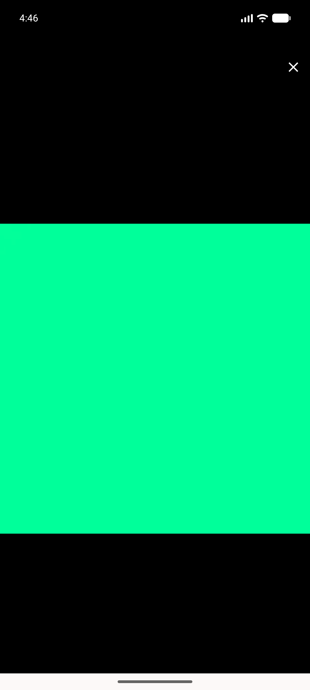
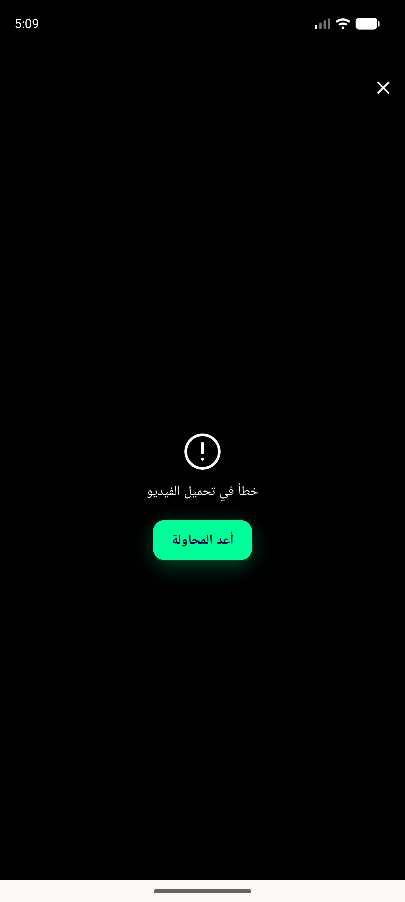

# QA Evidence — NEARS-1874

**PASS — lightbox Close seated below the 53dp status-bar inset; AC1+AC3 demonstrated, AC2 via NEARS-1732 proxy**

**3 screenshot(s).** Click any thumbnail for full resolution.

<table>
<tr>
<td align="center" width="33%"> ac1 final english lightbox</td>
<td align="center" width="33%"> ac1 lightbox open image arm</td>
<td align="center" width="33%"> ac2 lightbox video error arm</td>
</tr>
</table>

### Other artifacts
- [`bug-rtl-close-not-mirrored.log`](bug-rtl-close-not-mirrored.log)

---
*From `nears/docs/qa-evidence/NEARS-1874/` · public-repo scrub policy (no live secrets; verified clean).*
