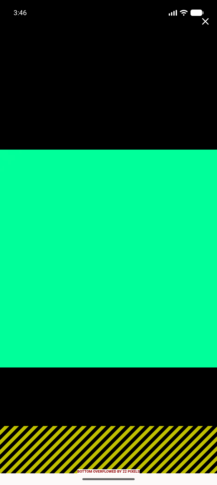

# QA Evidence — NEARS-1874

**PRE-FIX PROBE: mechanism CONFIRMED — Close painted under 53dp status-bar inset; centre tap consumed by SystemUI**

**1 screenshot(s).** Click any thumbnail for full resolution.

<table>
<tr>
<td align="center" width="33%"> bug close under statusbar</td>
</tr>
</table>

### Other artifacts
- [`bug-close-under-statusbar.log`](bug-close-under-statusbar.log)

---
*From `nears/docs/qa-evidence/NEARS-1874/` · public-repo scrub policy (no live secrets; verified clean).*
