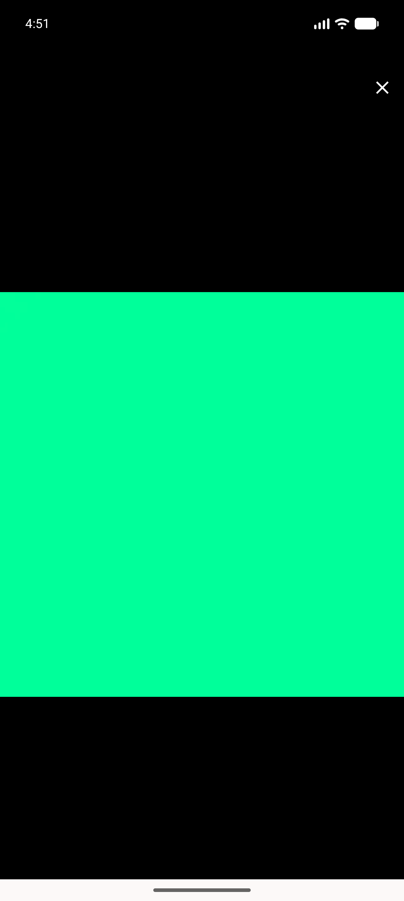

# QA Evidence — NEARS-1875

**PASS — RTL lightbox close mirrors to the leading (left) edge; close-band MSE 257.170 -> 0.001**

**2 screenshot(s).** Click any thumbnail for full resolution.

<table>
<tr>
<td align="center" width="33%"> ac1 rtl lightbox</td>
<td align="center" width="33%"> ac2 ltr lightbox</td>
</tr>
</table>

### Other artifacts
- [`measurement.md`](measurement.md)
- [`progress.md`](progress.md)

---
*From `nears/docs/qa-evidence/NEARS-1875/` · public-repo scrub policy (no live secrets; verified clean).*
