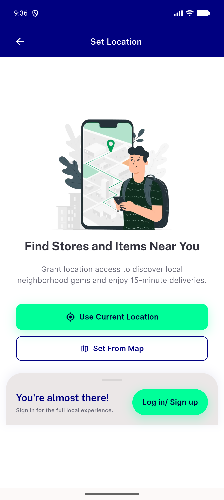
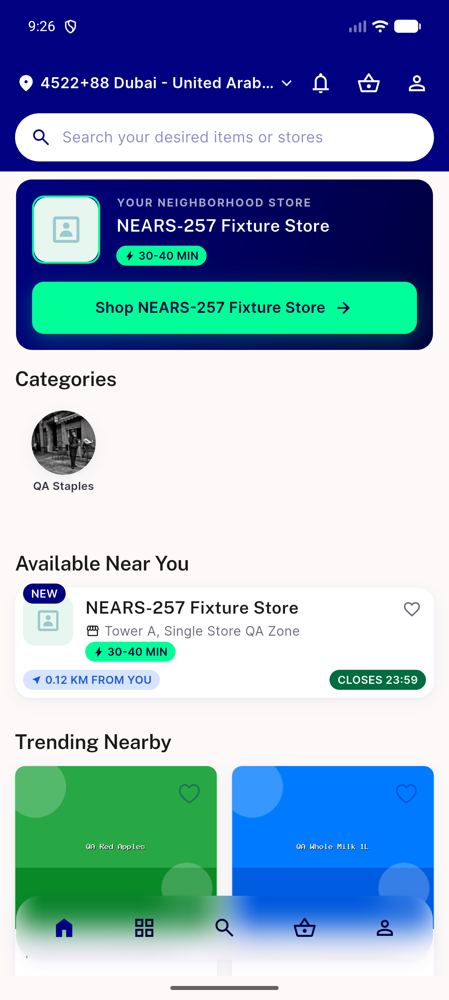
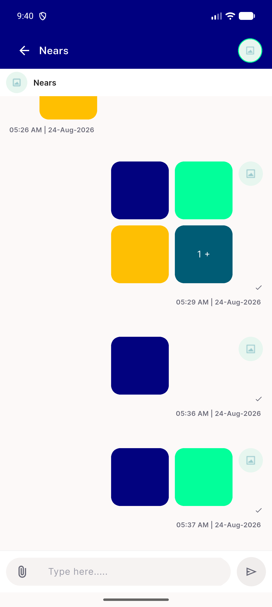
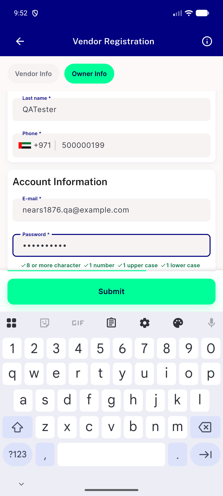
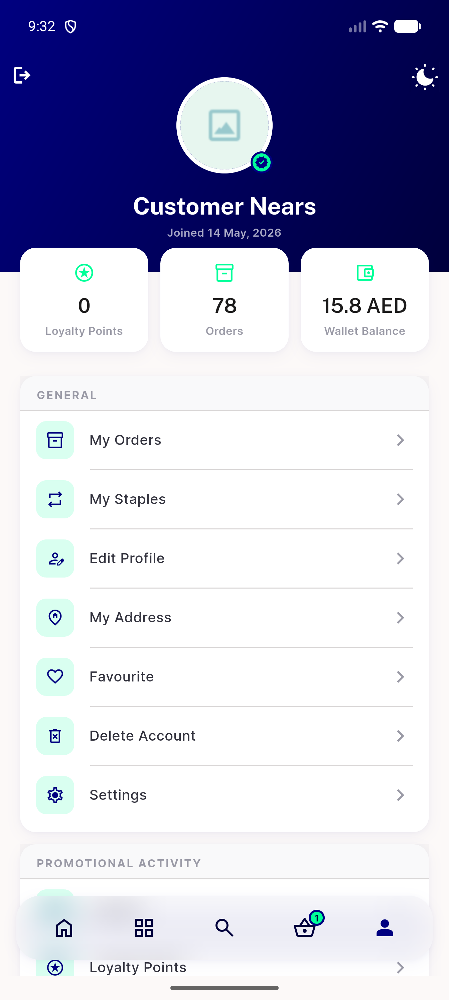
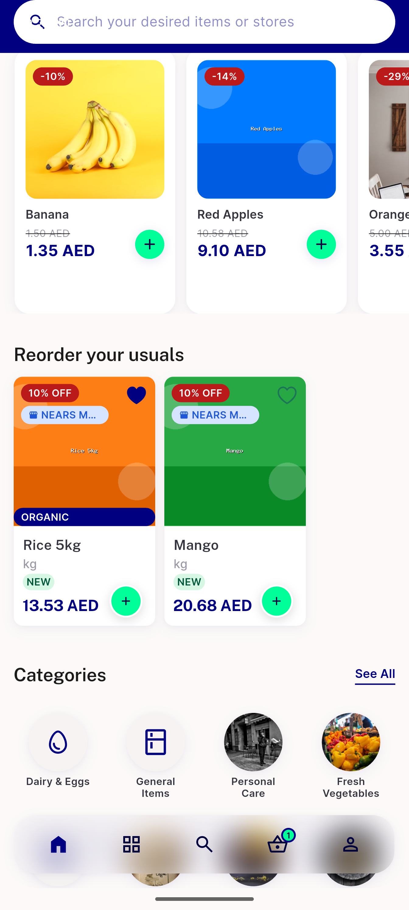
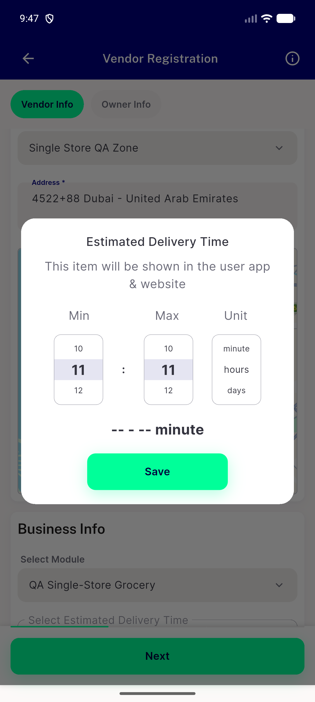
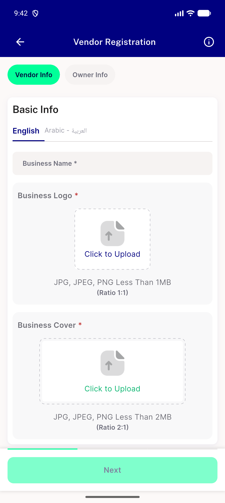

# QA Evidence — NEARS-1876

**PASS with 1 partial-unverifiable AC item (banner_view.dart Shop-module call sites unreachable - no active Shop module in this environment's DB)**

**11 screenshot(s).** Click any thumbnail for full resolution.

<table>
<tr>
<td align="center" width="33%"> ac2 ac3 refer earn</td>
<td align="center" width="33%"> ac3 access location</td>
<td align="center" width="33%"> ac3 banner hero</td>
</tr>
<tr>
<td align="center" width="33%"> ac3 coupon invite friend</td>
<td align="center" width="33%"> chat check</td>
<td align="center" width="33%"> owner info check</td>
</tr>
<tr>
<td align="center" width="33%"> owner info check2</td>
<td align="center" width="33%"> profile scroll check</td>
<td align="center" width="33%"> scroll1</td>
</tr>
<tr>
<td align="center" width="33%"> time picker</td>
<td align="center" width="33%"> vendor reg form</td>
</tr>
</table>

### Other artifacts
- [`bug-running-order-rail-prefetch.log`](bug-running-order-rail-prefetch.log)
- [`bug-vendor-register-403.log`](bug-vendor-register-403.log)

---
*From `nears/docs/qa-evidence/NEARS-1876/` · public-repo scrub policy (no live secrets; verified clean).*
