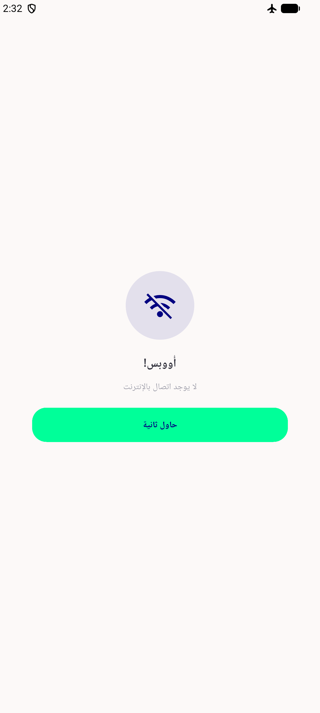
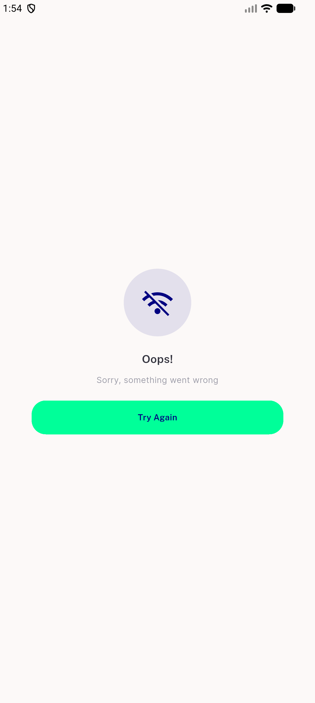

# QA Evidence — NEARS-1877

**PASS — 42 cold deep-link attempts on dd239138, 0 red screens (BASE 30/30 red); AC1-AC4 met**

**4 screenshot(s).** Click any thumbnail for full resolution.

<table>
<tr>
<td align="center" width="33%"> ac2 nonstore referandearn</td>
<td align="center" width="33%"> ac3 offline failure state</td>
<td align="center" width="33%"> ac3 rtl arabic failure state</td>
</tr>
<tr>
<td align="center" width="33%"> f1 live corrupt cache failure</td>
</tr>
</table>

### Other artifacts
- [`AC1_HEAD_probe_22s_45s.txt`](AC1_HEAD_probe_22s_45s.txt)
- [`AC1_HEAD_results.tsv`](AC1_HEAD_results.tsv)
- [`f1-live-corrupt-cache-failure.log`](f1-live-corrupt-cache-failure.log)
- [`progress.md`](progress.md)
- [`redfrac-detector.py`](redfrac-detector.py)

---
*From `nears/docs/qa-evidence/NEARS-1877/` · public-repo scrub policy (no live secrets; verified clean).*
