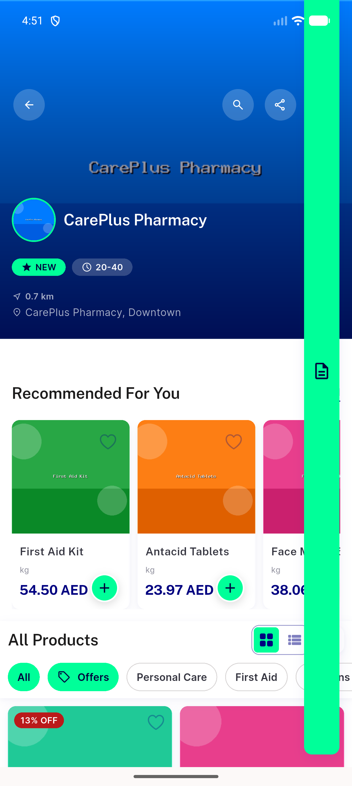
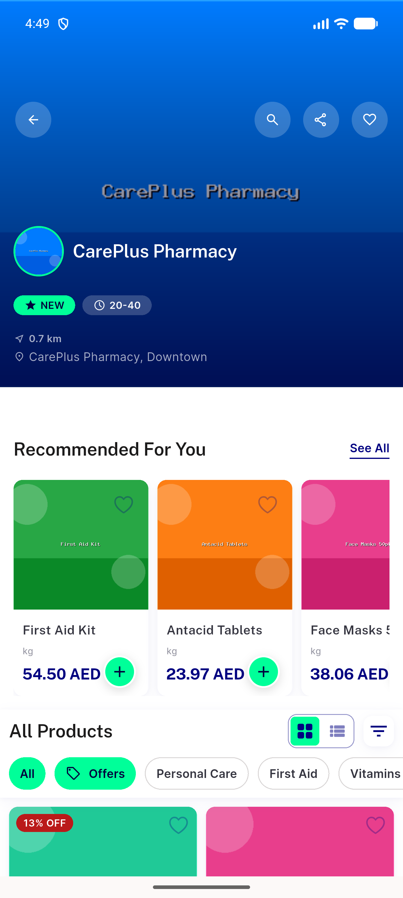
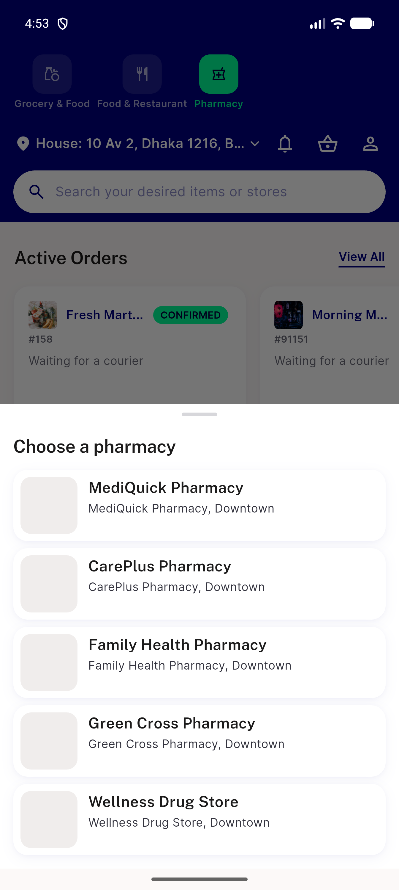

# QA Evidence — NEARS-1879

**PASS - AC3+AC4 demonstrated live, regression clean, config cache verified**

**3 screenshot(s).** Click any thumbnail for full resolution.

<table>
<tr>
<td align="center" width="33%"> ac3 loggedin store fab visible</td>
<td align="center" width="33%"> ac4 guest store no fab</td>
<td align="center" width="33%"> regression home cta choose pharmacy sheet</td>
</tr>
</table>

### Other artifacts
- [`ac4-guest-store-dump.xml`](ac4-guest-store-dump.xml)

---
*From `nears/docs/qa-evidence/NEARS-1879/` · public-repo scrub policy (no live secrets; verified clean).*
