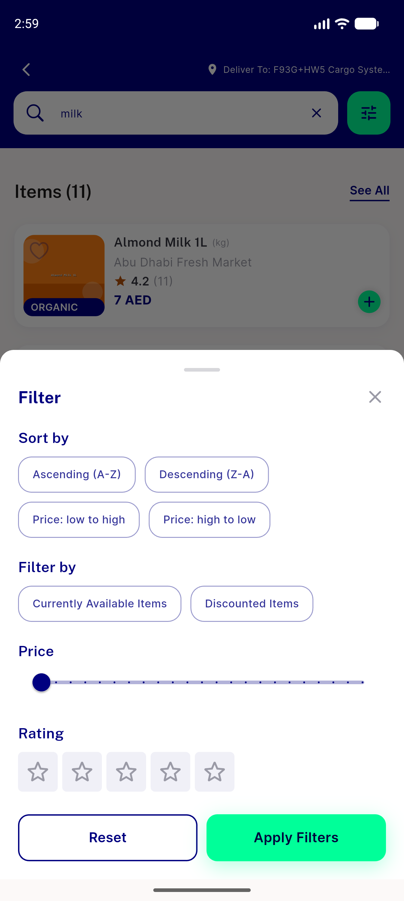

# QA Evidence — NEARS-1883

**MEASUREMENT COMPLETE — rendered a11y baseline for 1745/1746/1752/1754; census overstated on 11 of 14 sign-in elements**

**4 screenshot(s).** Click any thumbnail for full resolution.

<table>
<tr>
<td align="center" width="33%"> sign in rendered</td>
<td align="center" width="33%"> verification rendered</td>
<td align="center" width="33%"> sign up rendered</td>
</tr>
<tr>
<td align="center" width="33%"> nbutton tertiary reset rendered</td>
</tr>
</table>

### Other artifacts
- [`1745-sign-in-a11y-dump.xml`](1745-sign-in-a11y-dump.xml)
- [`1746-verification-a11y-dump.xml`](1746-verification-a11y-dump.xml)
- [`1754-sign-up-a11y-dump.xml`](1754-sign-up-a11y-dump.xml)
- [`measurement-table.md`](measurement-table.md)
- [`nbutton-tertiary-reset-a11y-dump.xml`](nbutton-tertiary-reset-a11y-dump.xml)

---
*From `nears/docs/qa-evidence/NEARS-1883/` · public-repo scrub policy (no live secrets; verified clean).*
